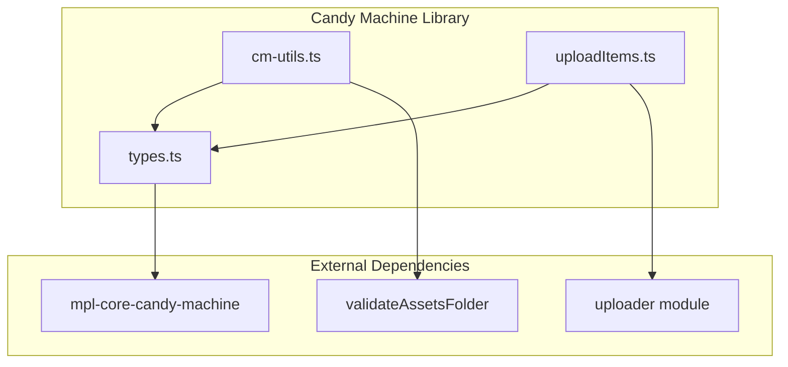

# Candy Machine Library

# Candy Machine Library

The Candy Machine Library provides utilities for managing Metaplex Candy Machine configurations, asset caches, and uploading NFT assets to decentralized storage. This module handles the file-based operations, type definitions, and upload workflows required to prepare and deploy a Candy Machine on Solana.

## Overview



## Type Definitions (`types.ts`)

The types module defines the shape of configuration files and asset caches used throughout the Candy Machine workflow.

### Guard Configuration Types

The library supports numerous guard types that control minting behavior. Each guard has a corresponding raw configuration type:

| Guard Type | Purpose |
|------------|---------|
| `RawAddressGate` | Restricts minting to specific wallet addresses |
| `RawAllocation` | Limits total mints across all wallets |
| `RawAllowList` | Merkle tree-based allowlist verification |
| `RawAssetBurn` | Requires burning a collection NFT |
| `RawAssetGate` | Requires owning a collection NFT |
| `RawBotTax` | Charges a fee for failed mint attempts (anti-bot) |
| `RawEndDate` | Sets a cutoff timestamp for minting |
| `RawFreezeSolPayment` | Locks funds with SOL payment |
| `RawGatekeeper` | Requires gateway token verification |
| `RawMintLimit` | Limits mints per wallet |
| `RawNftPayment` | Requires payment in NFTs |
| `RawSolPayment` | Requires SOL payment |
| `RawStartDate` | Sets a start timestamp for minting |
| `RawTokenPayment` | Requires payment in SPL tokens |
| `RawVanityMint` | Restricts mint addresses to regex pattern |

#### RawGuardConfig Type

```typescript
export type RawGuardConfig = NonEmptyObject<{
    addressGate?: RawAddressGuard
    allocation?: RawAllocation
    // ... all other guards
}>
```

This type uses a utility pattern that ensures at least one guard property is present. The `NonEmptyObject` type prevents creating guard configs with zero guards, which would be meaningless.

#### Guard Groups

```typescript
export type RawGuardGroup = {
    label: string      // Max 6 characters (MAX_GROUP_LABEL_LENGTH)
    guards: RawGuardConfig
}
```

Guard groups allow different minting conditions for different collection tiers.

### Candy Machine Configuration

```typescript
export interface CandyMachineConfig {
    name: string
    candyMachineId?: string
    directory?: string
    assetsDirectory?: string
    config: {
        collection: string           // Collection mint address
        itemsAvailable: number       // Total NFTs to mint
        isMutable: boolean           // Allow metadata updates
        isSequential: boolean        // Mint in order
        guardConfig?: RawGuardConfig // Default guards for all mints
        groups?: RawGuardGroup[]     // Tier-specific guards
        configLineSettings?: ConfigLineSettings
        hiddenSettings?: HiddenSettings
    }
}
```

### Asset Cache

The asset cache tracks the state of NFT assets throughout the upload process:

```typescript
export interface CandyMachineAssetCache {
    assetItems: Record<number, CandyMachineAssetCacheItem>
}

export interface CandyMachineAssetCacheItem {
    name: string
    image?: string           // Local file path
    imageUri?: string        // Uploaded URI
    imageType?: string       // MIME type
    animation?: string       // Local animation file
    animationUri?: string   // Uploaded animation URI
    animationType?: string   // Animation MIME type
    json?: string            // Local JSON metadata file
    jsonUri?: string         // Uploaded metadata URI
    loaded?: boolean         // Upload completed
    revealed?: string        // Core NFT address after reveal
}
```

## Utility Functions (`cm-utils.ts`)

### Path Management

```typescript
getCmPaths(directory?: string) => {
    configPath: string      // cm-config.json
    assetCachePath: string  // asset-cache.json
    assetsDir: string       // assets/
    baseDir: string         // Working directory
}
```

Returns standardized paths for Candy Machine files. Defaults to the current working directory if no directory is specified.

### Configuration File Operations

```typescript
// Read the candy machine configuration
readCmConfig(directory?: string): CandyMachineConfig

// Write configuration to file
writeCmConfig(config: CandyMachineConfig, directory?: string): void

// Read the asset cache
readAssetCache(directory?: string): CandyMachineAssetCache

// Persist asset cache after updates
writeAssetCache(assetCache: CandyMachineAssetCache, directory?: string): void
```

### Asset Cache Initialization

```typescript
createInitialAssetCache(directory?: string): Promise<CandyMachineAssetCache>
```

Creates an asset cache by scanning the assets directory. The function:

1. Validates the assets directory exists
2. Runs `validateAssetsFolder` to ensure proper structure
3. Reads each JSON metadata file to extract the NFT name
4. Maps image, animation, and JSON files to sequential indices
5. Returns an initial cache with `loaded: false` for all items

### Validation Functions

```typescript
// Verify assets directory exists
validateCmDirectory(directory?: string): void

// Validate configuration before deployment
validateCmConfig(config: CandyMachineConfig): void
```

`validateCmConfig` performs critical checks:
- Ensures no existing candy machine ID (prevents accidental overwrites)
- Verifies a collection is configured
- Confirms items available is positive

### Settings Resolution

```typescript
getConfigLineSettings(candyMachineConfig: CandyMachineConfig) => 
    {