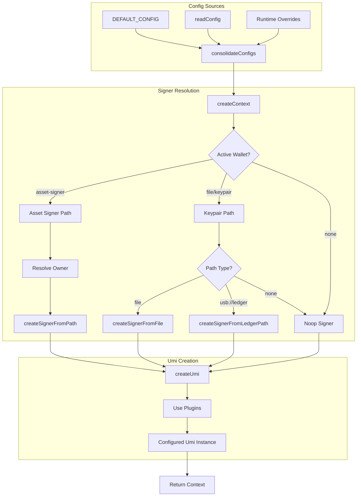

# Context & Signers

# Context & Signers Module

This module provides the foundation for transaction signing, configuration management, and Umi instance creation throughout the MPLx CLI. It handles the complexity of supporting multiple signer types (keypair files, Ledger hardware wallets, asset-signers) and consolidates configuration from various sources.

## Overview

The module serves three primary purposes:

1. **Configuration Management** — Reads and merges configuration from files, environment defaults, and runtime overrides
2. **Signer Resolution** — Creates appropriate signers from various sources (files, Ledger devices, PDA-based asset signers)
3. **Context Creation** — Initializes a complete Umi instance with all required plugins, signers, and RPC connections

## Configuration System

### ConfigJson Structure

The configuration is defined in `src/lib/Context.ts` and supports these fields:

```typescript
type ConfigJson = {
  commitment?: Commitment          // Transaction confirmation level
  keypair?: string                  // Default keypair path
  payer?: string                    // Fee payer keypair path
  rpcUrl?: string                   // RPC endpoint URL
  storage?: {                       // Storage provider config
    name: 'irys' | 'cascade' | 'turbo'
    options: any
  }
  wallets?: WalletEntry[]          // Named wallet aliases
  rpcs?: {                          // Named RPC endpoints
    name: string
    endpoint: string
  }[]
  explorer?: ExplorerType           // Block explorer preference
  activeWallet?: string             // Currently active wallet name
}
```

### Wallet Entries

Named wallets support three types:

```typescript
type WalletEntry = {
  name: string
  address: string
} & (
  | { type?: 'file'; path: string }           // Keypair file
  | { type: 'asset-signer'; asset: string; payer?: string }  // PDA-based signer
  | { type: 'agent'; asset: string; payer?: string }         // Agent-based signer
)
```

### Configuration Resolution

`consolidateConfigs()` merges multiple configuration sources with precedence:

1. **Default config** — Hardcoded defaults (`DEFAULT_CONFIG`)
2. **File config** — Read from `~/.config/mplx/config.json` (or custom path)
3. **Runtime overrides** — Passed directly to `createContext()`

```typescript
const config = consolidateConfigs(DEFAULT_CONFIG, readConfig(configPath), overrides)
```

The `readConfig()` function validates the config path exists and is a file, then filters to known configuration keys via `CONFIG_KEYS`.

## Signer Types

### File Signer

Loads a keypair from a JSON file containing the secret key bytes:

```typescript
createSignerFromFile(path: PathOrFileDescriptor): Signer
```

Used for standard keypair files in the format `[<byte>, <byte>, ...]`.

### Ledger Signer

Connects to a Ledger hardware wallet via USB HID:

```typescript
createSignerFromLedgerPath(path: string): Promise<Signer>
```

The path format is `usb://ledger?key="<number>[/<number>][/<number>]"` where the numbers derive the BIP44 derivation path (default: `44/501/0/0`). The signer implements the full Umi `Signer` interface with `signTransaction`, `signAllTransactions`, and `signMessage` methods.

### Noop Signer

Creates a dummy signer backed by a random keypair, used for PDA-based operations where instructions should be built with a specific address but not actually signed until execution:

```typescript
createNoopSigner(): Signer
```

## Context Creation

The `createContext()` function is the main entry point, returning a `Context` object:

```typescript
type Context = {
  commitment: Commitment
  payer?: Signer
  rpcUrl: string
  signer: Signer
  umi: Umi & { rpc: DasApiInterface }
  explorer: ExplorerType
  chain: RpcChain
}
```

### Umi Instance Setup

The created Umi instance includes these plugins:

- **MPL Programs**: mplCore, mplTokenMetadata, mplToolbox, mplBubblegum, mplDistro, mplCandyMachine, genesis, mplAgentIdentity, mplAgentTools
- **API**: dasApi (Digital Asset Standard)
- **Storage**: Configured provider (Irys, Cascade, or Turbo)
- **Signers**: Identity and payer set based on mode

## Asset Signer Mode

When the active wallet is configured as `asset-signer` or `agent` type, the context operates in a special mode for PDA-based signing.

### How It Works

1. **PDA as Identity** — Both `umi.identity` and `umi.payer` are set to a noop signer keyed to the PDA address. This causes all instruction building to naturally use the PDA as the signer.

2. **Real Wallet as Authority** — The actual wallet (from `ownerPath` or `config.keypair`) is stored separately and used by the send layer to wrap instructions in an `execute` instruction with the correct authority.

3. **Fee Payer Override** — The transaction fee payer is set to the real wallet via `setFeePayer()` before building and signing.

### Resolution Logic

```typescript
// From createContext()
const activeWallet = resolveActiveWallet(config)
const isAssetSigner = activeWallet?.type === 'asset-signer' || activeWallet?.type === 'agent'

if (isAssetSigner) {
  // Resolve owner wallet from payer reference in wallet config
  let ownerPath: string | undefined
  if (walletPayerName && config.wallets) {
    const ownerWallet = config.wallets.find(w => w.name === walletPayerName)
    // ... resolve path from non-asset-signer wallet
  }
  // Fall back to config.keypair
  // Fall back to error in transaction context
}
```

The asset signer plugin is applied to Umi when both `assetSigner` and `realWalletSigner` are available:

```typescript
umi.use(assetSignerPlugin({ info: assetSigner, authority: realWalletSigner, payer: feePayer }))
```

## Architecture



## Key Functions Reference

| Function | Purpose |
|----------|---------|
| `readConfig(path)` | Read and validate config file, filter to known keys |
| `consolidateConfigs(...configs)` | Deep merge multiple config objects |
| `createSignerFromFile(path)` | Load signer from JSON keypair file |
| `createSignerFromLedgerPath(path)` | Create signer from Ledger device |
| `createNoopSigner()` | Create dummy signer for PDA operations |
| `createContext(configPath, overrides, isTransactionContext)` | Main entry point — creates full Context |
| `resolveActiveWallet(config)` | Find active wallet entry from config |

## Usage Example

```typescript
// Create context with defaults, config file, and CLI overrides
const context = await createContext(
  '~/.config/mplx/config.json',
  { rpcUrl: 'https://api.mainnet.solana.com' },
  true // isTransactionContext
)

// Use the Umi instance
const umi = context.umi
const signer = context.signer

// Build and send a transaction
await someInstruction(umi).instruction()
  .addSigner(signer)
  .send()
```