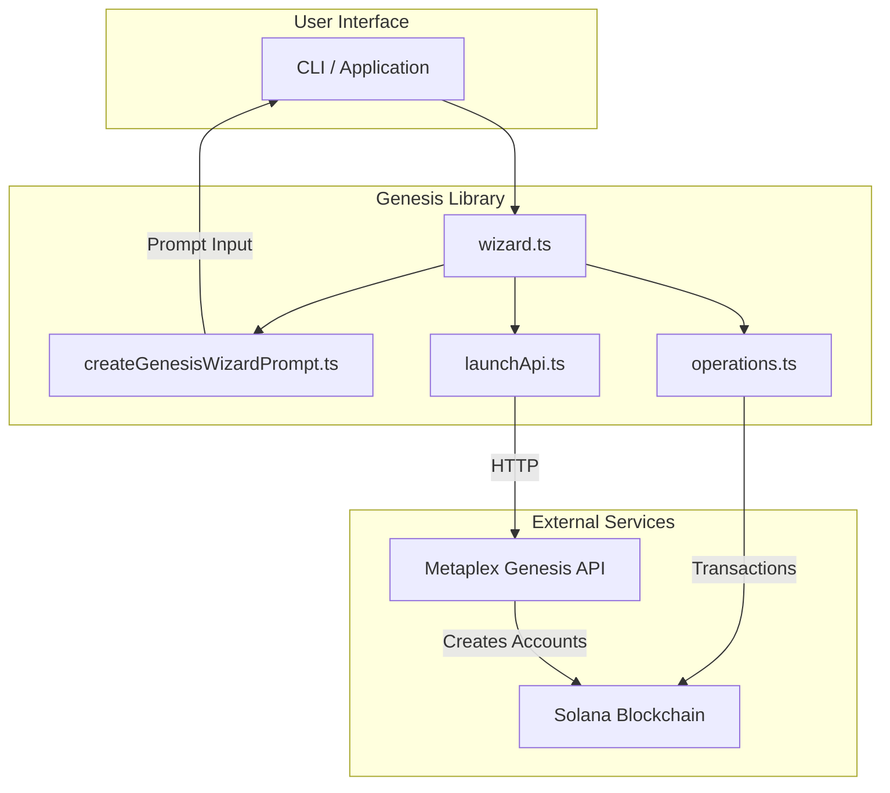

# Genesis Library

# Genesis Library

The Genesis Library provides a complete system for creating and managing token launches on Solana using the Metaplex Genesis program. It supports two launch modes: **LaunchPool** (project-style launches with deposit periods and Raydium liquidity) and **Bonding Curve** (instant launches with dynamic pricing).

The library offers two workflows:
- **API Wizard** — Delegates launch creation and registration to the Metaplex Genesis API
- **Manual Wizard** — Directly constructs and submits Solana transactions for full control

## Architecture Overview



## Core Concepts

### Genesis Account

The genesis account is the on-chain anchor for a token launch. It stores:
- Token metadata (name, symbol, decimals, URI)
- Base mint (the launched token) and quote mint (payment token)
- Funding mode (new mint or transfer from existing)
- Bucket configurations and state

### Buckets

Buckets define how tokens are distributed. Three bucket types exist:

| Bucket Type | Purpose | Key Parameters |
|-------------|---------|----------------|
| **Launch Pool** | Pro-rata allocation based on contributions | deposit period, raise goal, claim schedule |
| **Presale** | Fixed-price token sales | allocation, quote cap, deposit limits |
| **Unlocked** | Team/treasury allocations | recipient, claim schedule |

### Quote Mint

The payment token for the launch. Supported options:
- **SOL** — Wrapped SOL (`So11111111111111111111111111111111111111112`)
- **USDC** — USD Coin (`EPjFWdd5AufqSSqeM2qN1xzybapC8G4wEGGkZwyTDt1v`)
- **Custom** — Any SPL token

## Module Structure

### `createGenesisWizardPrompt.ts` — User Input Collection

This module handles all interactive prompts using `@inquirer/prompts`. It provides validators, timestamp conversion, and reusable prompt components.

#### Validators

All validators support early exit by typing `q`:

```typescript
// Validate Solana public keys
validatePublicKey(v: string): string | true
validateOptionalPublicKey(v: string): string | true

// Validate timestamps (ISO or unix)
validateTimestamp(v: string, opts?: { requireFuture?: boolean; allowEmpty?: boolean }): string | true

// Validate URLs with platform-specific rules
validateUrlField(v: string, type: 'website' | 'twitter' | 'telegram'): string | true
```

#### Timestamp Conversion

```typescript
// Convert user input to unix seconds (for on-chain data)
toUnixTimestamp(v: string): string

// Convert to ISO string (for API calls expecting Date | string)
toISOTimestamp(v: string): string
```

Both functions accept ISO 8601 dates (`2025-06-01T00:00:00Z`) or unix timestamps in seconds.

#### Shared Prompt Components

```typescript
// Token metadata: name, symbol, image, description
promptTokenMetadata(): Promise<{ name, symbol, image, description? }>

// Social links: website, twitter, telegram
promptSocialLinks(): Promise<{ website?, twitter?, telegram? }>

// Quote mint selection with known token shortcuts
promptQuoteMint(): Promise<string>

// Project configuration for launchpool launches
promptProjectConfig(quoteMint: string): Promise<{
  tokenAllocation: number
  raiseGoal: number
  raydiumLiquidityBps: number
  fundsRecipient: string
}>

// Agent configuration for on-chain agent execution
promptAgentConfig(): Promise<{ agentAsset?, agentSetToken? }>

// Bonding curve specific options
promptBondingCurveConfig(): Promise<{ creatorFeeWallet?, firstBuyAmount? }>
```

#### Manual Wizard Prompts

```typescript
// Create genesis account
promptGenesisCreate(): Promise<GenesisCreateResult>

// Bucket creation prompts
promptLaunchPoolBucket(nextIndex: number): Promise<AddLaunchPoolParams>
promptPresaleBucket(nextIndex: number): Promise<AddPresaleParams>
promptUnlockedBucket(nextIndex: number): Promise<AddUnlockedParams>
promptBucketChoice(): Promise<BucketChoice>
```

#### API Wizard Prompts

```typescript
// Full launch wizard combining all prompts
promptLaunchWizard(): Promise<LaunchWizardResult>

// Platform registration
promptRegisterLaunch(): Promise<RegisterLaunchResult>
```

### `operations.ts` — On-Chain Operations

Direct blockchain interactions using `@metaplex-foundation/genesis` and `@metaplex-foundation/umi`.

#### Creating a Genesis Account

```typescript
async function createGenesisAccount(
  umi: Umi,
  signer: Signer,
  payer: Signer | undefined,
  params: CreateGenesisParams
): Promise<{
  genesisAccountPda: PublicKey
  baseMintPubkey: PublicKey
  quoteMintPubkey: PublicKey
  signature: string
}>
```

The `CreateGenesisParams` interface:

```typescript
interface CreateGenesisParams {
  name: string           // Token name (1-32 chars)
  symbol: string         // Token symbol (1-10 chars)
  totalSupply: string    // Total supply as string (base units)
  decimals: number       // Token decimals (0-18)
  uri: string            // Metadata URI
  fundingMode: 'new-mint' | 'transfer'
  baseMint?: string      // Required if fundingMode='transfer'
  quoteMint?: string     // Optional, defaults to SOL
  genesisIndex?: number  // Optional, defaults to 0
}
```

#### Adding Buckets

```typescript
// Launch Pool bucket with optional extensions
addLaunchPoolBucket(
  umi, signer, payer,
  genesisAccount, baseMint, quoteMint,
  params: AddLaunchPoolParams
): Promise<{ bucketPda: PublicKey; signature: string }>

// Presale bucket with deposit limits
addPresaleBucket(
  umi, signer, payer,
  genesisAccount, baseMint, quoteMint,
  params: AddPresaleParams
): Promise<{ bucketPda: PublicKey; signature: string }>

// Unlocked bucket for team/treasury
addUnlockedBucket(
  umi, signer, payer,
  genesisAccount, baseMint, quoteMint,
  params: AddUnlockedParams
): Promise<{ bucketPda: PublicKey; signature: string }>
```

**Launch Pool Extensions** — Optional parameters for launch pools:
- `minimumDeposit` — Minimum contribution amount
- `depositLimit` — Maximum contribution per user
- `minimumQuoteTokenThreshold` — Minimum total raise before distribution

#### Finalizing

```typescript
finalizeGenesis(
  umi, signer,
  genesisAccount, baseMint,
  bucketCount: number
): Promise<string>
```

Finalization locks the genesis account and prepares buckets for claiming. The function fetches all bucket PDAs and includes them as remaining accounts in the finalize transaction.

### `launchApi.ts` — API Input Builder

Constructs the input structure for the Metaplex Genesis API.

```typescript
buildLaunchInput(
  wallet: string,
  chain: RpcChain,
  params: BuildLaunchInputParams,
  networkOverride?: SvmNetwork
): CreateLaunchInput
```

The `BuildLaunchInputParams` interface supports both launch types:

```typescript
interface BuildLaunchInputParams {
  launchType: 'launchpool' | 'bondingCurve'
  token: { name, symbol, image, description? }
  socials?: { website?, twitter?, telegram? }
  quoteMint?: string
  // Launchpool-specific
  depositStartTime?: string
  tokenAllocation?: number
  raiseGoal?: number
  raydiumLiquidityBps?: number
  fundsRecipient?: string
  // Bonding-curve-specific
  creatorFeeWallet?: string
  firstBuyAmount?: number
  // Agent support
  agent?: AgentConfig
}
```

#### API URLs

```typescript
getDefaultApiUrl(network: SvmNetwork): string
// Returns:
//   'solana-mainnet' → 'https://api.metaplex.com'
//   'solana-devnet'  → 'https://api.metaplex.dev'
```

### `wizard.ts` — Orchestration

Coordinates the full wizard flow, combining prompts with operations.

#### Context and Logging

```typescript
interface WizardContext {
  umi: Umi
  identity: Signer
  payer: Signer | undefined
  chain: RpcChain
  commitment: string
  explorer: ExplorerType
  apiUrl: string
}

interface WizardLogger {
  log: (msg: string) => void
  logSuccess: (msg: string) => void
  warn: (msg: string) => void
  logJson: (obj: unknown) => void
}
```

#### API Wizard Flow

```typescript
runApiWizard(ctx: WizardContext, logger: WizardLogger): Promise<ApiWizardResult>
```

The API wizard:
1. Collects launch configuration via `promptLaunchWizard`
2. Builds API input via `buildLaunchInput`
3. Calls `createAndRegisterLaunch` from `@metaplex-foundation/genesis`
4. Returns launch details including genesis account, mint address, and platform registration

#### Manual Wizard Flow

```typescript
runManualWizard(ctx: WizardContext, logger: WizardLogger): Promise<ManualWizardResult>
```

The manual wizard proceeds in steps:

1. **Create Genesis Account** — Collects token metadata and creates the on-chain account
2. **Add Buckets** — Interactive loop adding launch pool, presale, or unlocked buckets
3. **Finalize** — Optional finalization (required before claiming)
4. **Register** — Optional platform registration via the API

## Usage Example

```typescript
import { runApiWizard, runManualWizard } from './wizard.js'
import { getDefaultApiUrl } from './launchApi.js'

// API-based launch
const apiResult = await runApiWizard(
  {
    umi,
    identity: wallet,
    payer: wallet,
    chain: 'solana-mainnet',
    commitment: 'confirmed',
    explorer: 'solana',
    apiUrl: getDefaultApiUrl('solana-mainnet'),
  },
  {
    log: console.log,
    logSuccess: (msg) => console.log('✓', msg),
    warn: (msg) => console.warn('⚠', msg),
    logJson: (obj) => console.log(JSON.stringify(obj, null, 2)),
  }
)

// Manual launch with full control
const manualResult = await runManualWizard(ctx, logger)
```

## Error Handling

The wizards handle errors at each stage:

- **Validation errors** — Caught by prompt validators before submission
- **Transaction failures** — Caught and logged with explorer links
- **API errors** — Response body is logged for debugging
- **Partial failures** — Bucket creation failures don't block the wizard; users can retry or continue

Type `q` at any prompt to abort the wizard cleanly.

## Constants

```typescript
// Minimum raise goals by quote token
const MIN_RAISE_GOAL = {
  SOL: 250,
  USDC: 25000,
}

// Known quote mint addresses
const KNOWN_QUOTE_MINTS = {
  SOL: 'So11111111111111111111111111111111111111112',
  USDC: 'EPjFWdd5AufqSSqeM2qN1xzybapC8G4wEGGkZwyTDt1v',
}
```