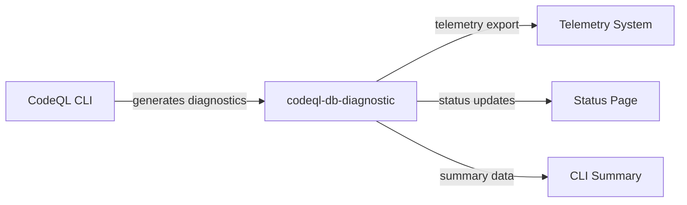

# Other — codeql-db-diagnostic

# codeql-db-diagnostic Module

## Overview

The `codeql-db-diagnostic` module collects and stores diagnostic information from CodeQL CLI operations. It serves as a telemetry and error logging repository for database-related CLI activities, capturing execution metadata, platform information, and error conditions.

## Purpose

This module provides diagnostic capture for:

- **CLI command telemetry** — Recording execution duration, status, and outcomes
- **Platform diagnostics** — Capturing environment details (architecture, OS, version)
- **Error tracking** — Logging fatal errors with exit codes and command details
- **Visibility control** — Supporting selective exposure of diagnostics to different consumers (telemetry systems, status pages, CLI summaries)

## Diagnostic Records

The module stores JSON-formatted diagnostic entries with a consistent structure:

```json
{
  "timestamp": "ISO-8601 timestamp",
  "source": {
    "id": "unique source identifier",
    "human-readable name"
  },
  "visibility": {
    "telemetry": boolean,
    "statusPage": boolean,
    "cliSummaryTable": boolean
  },
  "attributes": {
    "key": "value"
  },
  "severity": "error",        // optional, only for errors
  "plaintextMessage": "..."  // optional, only for errors
}
```

### Visibility Controls

Each diagnostic record includes visibility flags that determine where the information can be displayed:

| Flag | Purpose |
|------|---------|
| `telemetry` | Include in telemetry exports |
| `statusPage` | Display on status dashboards |
| `cliSummaryTable` | Show in CLI summary output |

## Record Types

### 1. Telemetry Records

Records operational metrics without error conditions:

```json
{
  "source": {"id": "cli/file-coverage-baseline", "name": "File coverage baseline telemetry"},
  "visibility": {"cliSummaryTable": false, "statusPage": false, "telemetry": true},
  "attributes": {"durationMilliseconds": 309}
}
```

### 2. Platform Records

Captures runtime environment information:

```json
{
  "source": {"id": "cli/platform", "name": "Platform"},
  "visibility": {"cliSummaryTable": false, "statusPage": false, "telemetry": true},
  "attributes": {"arch": "amd64", "version": "6.6.87.2-microsoft-standard-WSL2", "name": "Linux"}
}
```

### 3. Error Records

Logs failures with full context:

```json
{
  "source": {"id": "cli/database/create", "name": "CodeQL CLI: database create"},
  "plaintextMessage": "A fatal error occurred: Exit status 2 from command: [sh, -lc, 'pnpm, install, &&, pnpm, run, build']",
  "severity": "error",
  "visibility": {"telemetry": false},
  "attributes": {"exitCode": 2}
}
```

## File Naming Convention

Diagnostic files follow the pattern:

```
cli-diagnostics-add-{ISO_TIMESTAMP}.json
```

The timestamp enables:
- Chronological ordering
- Unique identification
- Correlation with other system logs

## Integration Points

This module operates as a diagnostic sink with no direct code dependencies:



## Usage Considerations

### Error Visibility

Note that error records may set `telemetry: false`, which prevents them from being exported to telemetry systems while still preserving them locally for debugging.

### Timestamp Format

Timestamps use ISO-8601 format with timezone offset:
```
2026-04-29T20:31:19.578843962-04:00
```

### Attribute Variability

The `attributes` object is flexible and contains source-specific key-value pairs:
- Duration-based records include `durationMilliseconds`
- Platform records include `arch`, `version`, `name`
- Error records include `exitCode`

## Troubleshooting

When investigating CLI failures:

1. Locate the relevant diagnostic file by timestamp
2. Check for entries with `severity: "error"`
3. Review the `plaintextMessage` for human-readable