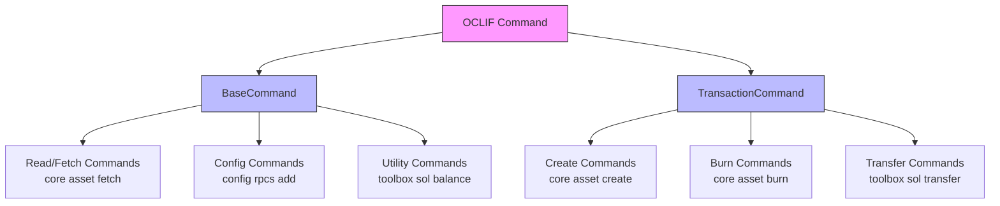

# Other — COMMANDS.md

# Command Output Guidelines

This document defines the standard output contract for all `mplx` CLI commands. All commands must follow these guidelines to ensure consistent behavior when using `--json` mode, which is critical for AI agents, scripts, and programmatic tooling.

## Overview

The `mplx` CLI is built on [OCLIF](https://oclif.io/), a framework that provides built-in support for JSON output via the `--json` flag. When this flag is passed, OCLIF captures the return value of the command's `run()` method and serializes it to stdout as JSON.

This behavior has important implications:

- **Human-readable output** (spinners, `this.log()`, `this.logSuccess()`) is automatically suppressed in JSON mode
- **The return value from `run()` becomes the JSON output** — this is the only thing that reaches stdout
- **Every command must return a plain, JSON-serializable object** — no `undefined`, `void`, raw strings, or non-serializable types

## Command Type Hierarchy



All custom commands should extend either `BaseCommand` or `TransactionCommand`, not the raw OCLIF `Command`. These base classes provide:

- `static enableJsonFlag = true` — enables the `--json` flag
- Standardized logging methods (`this.log()`, `this.logSuccess()`)
- Helper methods for constructing explorer URLs

## Standard Return Shapes

### Transaction Commands (`TransactionCommand`)

Any command that sends a blockchain transaction must return an object containing at minimum:

| Field | Type | Description |
|-------|------|-------------|
| `signature` | `string` | Base58 transaction signature |
| `explorer` | `string` | Explorer URL for the transaction |

Plus any command-specific fields (asset address, mint, collection, etc.).

**Example — `core asset create`:**

```json
{
  "asset": "ABC...XYZ",
  "signature": "5fg...hij",
  "explorer": "https://explorer.solana.com/tx/5fg...hij",
  "coreExplorer": "https://core.metaplex.com/explorer/ABC...XYZ"
}
```

**Example — `core asset burn`:**

```json
{
  "asset": "ABC...XYZ",
  "signature": "5fg...hij",
  "explorer": "https://explorer.solana.com/tx/5fg...hij"
}
```

**Example — `toolbox sol transfer`:**

```json
{
  "from": "ABC...XYZ",
  "to": "DEF...UVW",
  "amount": 1.5,
  "signature": "5fg...hij",
  "explorer": "https://explorer.solana.com/tx/5fg...hij"
}
```

### Read / Fetch Commands (`BaseCommand`)

Commands that only read data from the blockchain should return the data directly — no wrapper object is needed. The fetched data itself becomes the JSON output.

**Example — `core asset fetch`:**

```json
{
  "publicKey": "ABC...XYZ",
  "name": "My NFT",
  "uri": "https://...",
  "owner": "DEF...UVW",
  ...
}
```

### Config / Mutation Commands

Commands that modify local configuration (not blockchain state) should return the created or updated resource:

**Example — `config rpcs add`:**

```json
{
  "name": "devnet",
  "endpoint": "https://api.devnet.solana.com"
}
```

**Example — `config wallets add`:**

```json
{
  "name": "my-wallet",
  "address": "ABC...XYZ",
  "path": "/path/to/keypair.json"
}
```

### Utility Commands

Commands that compute or calculate values should return that value directly:

**Example — `toolbox rent`:**

```json
{
  "bytes": 1024,
  "rentSol": 0.00713856,
  "rentLamports": 7138560
}
```

**Example — `toolbox sol balance`:**

```json
{
  "address": "ABC...XYZ",
  "balance": 1.5
}
```

**Example — `toolbox sol airdrop`:**

```json
{
  "address": "ABC...XYZ",
  "amount": 1
}
```

## Rules

### 1. Every `run()` Must Return an Object

The `run()` method must always return a plain, JSON-serializable object. Never return:

- `undefined` or `void`
- A plain string (e.g., `"Transaction successful"`)
- A number or boolean directly

If there's nothing meaningful to return, return an empty object `{}` or an object with a status field like `{ "success": true }`.

### 2. Transaction Commands Always Include Signature and Explorer

Every command that submits a blockchain transaction must include both:

- `signature` — the base58-encoded transaction signature
- `explorer` — a URL to view the transaction in a block explorer

Use helper methods from `TransactionCommand` to construct these values consistently.

### 3. Use `this.log()` Instead of `console.log()`

Never use raw `console.log()` in commands. Instead, use:

- `this.log(message)` — for general output
- `this.logSuccess(message)` — for success messages

These methods are automatically suppressed when `--json` is passed, ensuring clean JSON output without human-readable noise.

### 4. Enable the JSON Flag

Every command class must have `static enableJsonFlag = true`. This is provided by `BaseCommand` and `TransactionCommand`, but if you extend the raw OCLIF `Command` class directly, you must set it explicitly.

### 5. Spinners and Human Output Are Fine

OCLIF automatically suppresses spinners, `this.log()`, and `this.logSuccess()` output when `--json` mode is active. You can freely use these for better human experience without affecting JSON consumers.

### 6. Return Plain Primitives Only

The return value must be JSON-serializable. Convert non-serializable types:

- `PublicKey` → `.toString()`
- `Uint8Array` → convert to base58 string
- Custom objects → ensure they have `toJSON()` or return plain object representations

Use utility functions like `txSignatureToString()` for consistent formatting.

## Checklist for New Commands

Use this checklist when implementing a new command to ensure it follows the output contract:

- [ ] **Extends `BaseCommand` or `TransactionCommand`** — not raw `Command`
- [ ] **`run()` returns a typed, JSON-serializable object** — never `undefined` or raw strings
- [ ] **Transaction commands include `signature` and `explorer`** in the return object
- [ ] **No raw `console.log()` calls** — use `this.log()` instead
- [ ] **Human-readable output uses `this.log()` / `this.logSuccess()`** — so it is suppressed in `--json` mode
- [ ] **Return values are plain primitives** — no `PublicKey`, `Uint8Array`, or custom classes

## Why This Matters

Consistent JSON output enables:

- **AI agent integration** — agents can reliably parse command results
- **Scripting** — shell scripts and CI/CD pipelines can consume output programmatically
- **Tooling** — third-party tools can build on the `mplx` CLI
- **Testing** — JSON output is easy to assert against in tests

By following these guidelines, you ensure that any tool consuming `mplx` CLI output gets a predictable, parseable result regardless of which command is run.