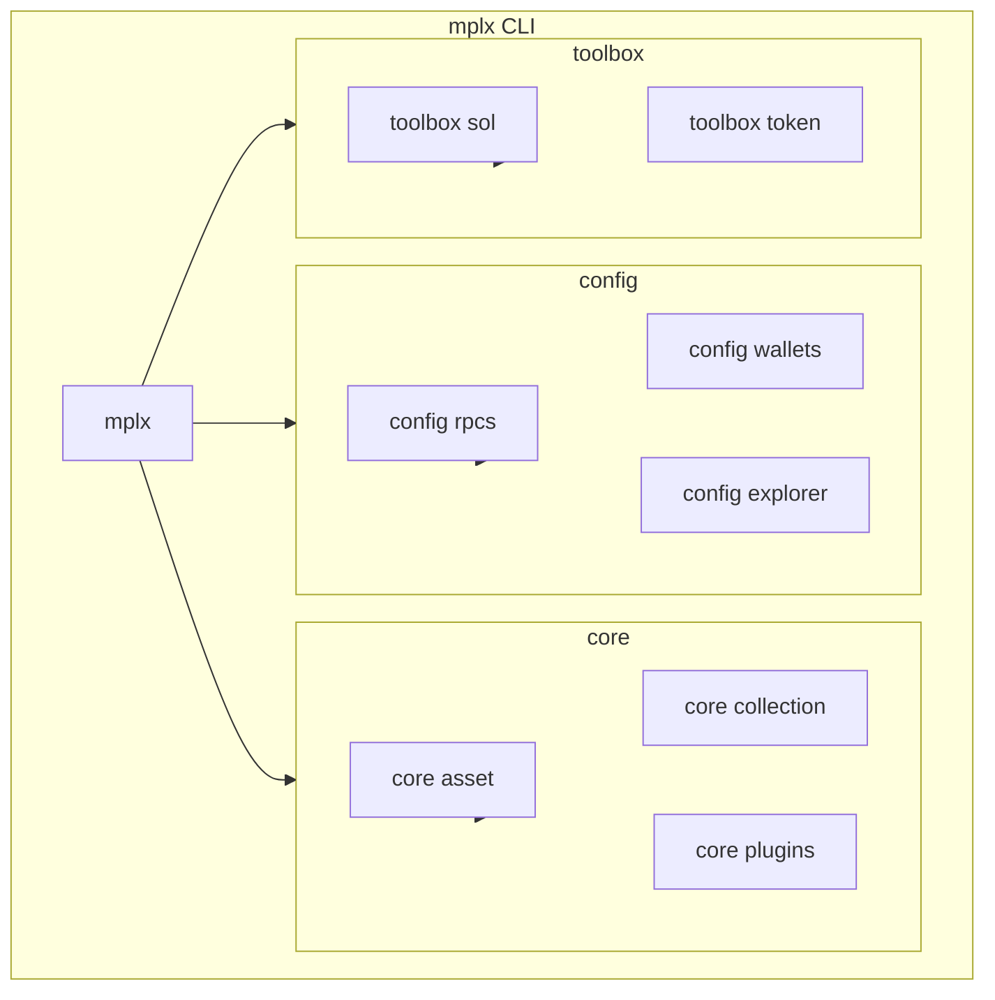

# Other — docs

# Metaplex CLI Documentation Module

This module contains the user-facing documentation for the `mplx` CLI tool, a command-line interface for interacting with the Solana blockchain using the Metaplex protocol. The documentation covers three primary command groups: configuration management, Core asset operations, and utility functions.

## Overview

The `mplx` CLI provides a unified interface for:

- **Configuration** — Managing RPC endpoints, wallets, and explorer preferences
- **Core Operations** — Creating and managing digital assets and collections
- **Toolbox Utilities** — Common operations like SOL and token management



## Command Groups

### Configuration Commands

The `config` commands manage CLI settings stored in `~/.config/mplx/config.json`:

| Command | Purpose |
|---------|---------|
| `mplx config` | Display current configuration |
| `mplx config rpcs add <name> <url>` | Register a new RPC endpoint |
| `mplx config rpcs list` | Show all configured RPCs |
| `mplx config rpcs set` | Select active RPC (interactive or direct) |
| `mplx config wallets set <name> <path>` | Add a named wallet |
| `mplx config wallets list` | Show all configured wallets |
| `mplx config explorer set <explorer>` | Set preferred block explorer |

Configuration supports interactive wizards for RPC and wallet selection, presenting a selectable list of previously configured options.

### Core Commands

The `core` commands interface with the Metaplex Core protocol for digital asset management:

**Asset Operations**
```bash
mplx core asset create --name "Asset Name" --uri "https://..."
mplx core asset create --files --image ./image.png --json ./metadata.json
mplx core asset create --directory ./assets
mplx core asset burn <assetId>
```

**Collection Operations**
```bash
mplx core collection create --name "Collection" --uri "https://..." --symbol "SYM"
```

**Plugin Management**
```bash
mplx core plugins add <assetId> --wizard
mplx core plugins remove <assetId>
```

Supported plugin types include Royalties, FreezeDelegate, BurnDelegate, TransferDelegate, UpdateDelegate, PermanentFreezeDelegate, Attributes, PermanentTransferDelegate, PermanentBurnDelegate, MasterEdition, Edition, and Autograph.

### Toolbox Commands

The `toolbox` commands provide utility functions:

**SOL Operations**
```bash
mplx toolbox sol balance [address]
mplx toolbox sol transfer <amount> <recipient>
```

**Token Operations**
```bash
mplx toolbox token create --wizard
mplx toolbox token create --name "Token" --symbol "TKN" --decimals 9 --mint 1000000000
mplx toolbox token update <mint> --name "New Name"
mplx toolbox token transfer <mint> <amount> <recipient>
```

## File Structure

The documentation follows a flat structure with dedicated files for each command group:

```
docs/
├── config.md    # Configuration command reference
├── core.md      # Core asset/collection operations
└── toolbox.md   # Utility commands
```

## Configuration Schema

The CLI stores settings in JSON format:

```json
{
  "keypair": "/path/to/wallet.json",
  "rpcUrl": "https://api.devnet.solana.com",
  "explorer": "solscan",
  "wallets": {
    "default": "dev1",
    "dev1": "/home/user/.config/solana/dev1.json"
  },
  "rpcs": {
    "helius": "https://devnet.helius-rpc.com/?api-key=<key>"
  }
}
```

## Common Patterns

Several commands share common options across the CLI:

- **`--wizard`**: Launches interactive prompts for guided configuration
- **`--files`**: Enables file upload mode for metadata and images
- **`--directory`**: Batch processing of multiple assets from a folder

## Best Practices

1. **Test on devnet** — Use devnet for development before production deployments
2. **Verify addresses** — Always confirm wallet and asset IDs before operations
3. **Back up configurations** — Preserve wallet paths and RPC settings
4. **Use wizards** — The `--wizard` flag reduces errors for complex operations
5. **Monitor transactions** — Use the configured explorer to verify on-chain state