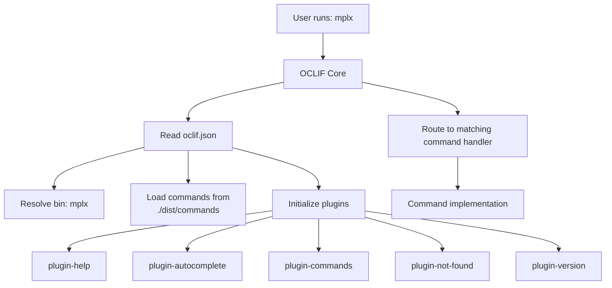

# Other — oclif.json

# oclif.json Configuration

## Overview

This file is the **primary configuration manifest** for the MPLX CLI, built on [OCLIF](https://oclif.io/) (Open CLI Framework). It defines how the CLI is structured, what plugins are loaded, and where command implementations are located.

OCLIF reads this file at runtime to bootstrap the command-line interface, resolve plugin dependencies, and route user commands to their handlers.

## Configuration Reference

```json
{
    "bin": "mplx",
    "dirname": "mplx",
    "commands": "./dist/commands",
    "plugins": [
        "@oclif/plugin-help",
        "@oclif/plugin-autocomplete",
        "@oclif/plugin-commands",
        "@oclif/plugin-not-found",
        "@oclif/plugin-version"
    ],
    "topicSeparator": " "
}
```

### Field Definitions

| Field | Value | Purpose |
|-------|-------|---------|
| `bin` | `"mplx"` | The executable name users type to invoke the CLI |
| `dirname` | `"mplx"` | Directory name used for config resolution (typically matches `bin`) |
| `commands` | `"./dist/commands"` | Path to compiled command modules (TypeScript → JavaScript output) |
| `plugins` | `array` | List of OCLIF plugins to load at startup |
| `topicSeparator` | `" "` | Separator between command topics (e.g., `mplx topic command`) |

### Plugins

The CLI includes five OCLIF plugins:

- **`@oclif/plugin-help`** — Generates and displays help output for commands (`mplx --help`, `mplx <command> --help`)
- **`@oclif/plugin-autocomplete`** — Provides tab completion for shells (bash, zsh, fish)
- **`@oclif/plugin-commands`** — Lists all available commands (`mplx commands`)
- **`@oclif/plugin-not-found`** — Handles unknown commands with helpful suggestions
- **`@oclif/plugin-version`** — Outputs version information (`mplx --version`, `mplx version`)

## Architecture Integration

OCLIF uses this configuration during its bootstrap phase. The following diagram shows how the configuration connects to the runtime:



## Build Relationship

The `commands` path points to `./dist/commands`, indicating:

1. Source TypeScript commands live in `src/commands/` (or similar)
2. The build process compiles them to JavaScript in `dist/commands/`
3. OCLIF loads the compiled JavaScript at runtime

This is the standard pattern for TypeScript-based OCLIF projects.

## Extending the CLI

To add a new command to the CLI:

1. Create a TypeScript file in `src/commands/` (or the source equivalent)
2. Export a class that extends `oclif.Command`
3. Build the project — the compiled output appears in `dist/commands/`
4. OCLIF automatically discovers and registers the command on next startup

To add functionality via plugins, add the package to both `package.json` dependencies and the `plugins` array in this file.

## Notes

- This file contains **no runtime logic** — it is purely declarative configuration
- OCLIF validates this file on startup; malformed JSON causes immediate failure
- The `topicSeparator` value `" "` means multi-word commands use spaces: `mplx my command` rather than `mplx:my:command`