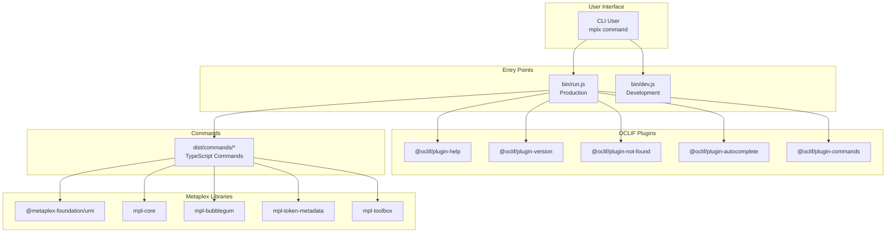

# Other — package.json

# @metaplex-foundation/cli

The official Metaplex Command Line Interface (CLI) for interacting with the Metaplex ecosystem on Solana. This CLI provides commands for managing digital assets, candy machines, token metadata, and other Metaplex-related operations.

## Overview

This package is built on [OCLIF](https://oclif.io/) (Open CLI Framework) and provides a TypeScript-based command-line interface for developers and users to interact with various Metaplex programs on the Solana blockchain.



## Package Configuration

| Field | Value |
|-------|-------|
| **Name** | `@metaplex-foundation/cli` |
| **Version** | 0.4.0 |
| **Type** | ES Module (`"type": "module"`) |
| **License** | Metaplex License |
| **Node.js** | >= 20.0.0 |
| **Package Manager** | pnpm 9.12.3 |

## Binary & Entry Points

The CLI exposes the `mplx` command through two entry points:

### Production Entry Point
```json
"bin": {
  "mplx": "./bin/run.js"
}
```

### Development Entry Point
```bash
pnpm dev    # Uses ./bin/dev.js for hot-reload development
```

## OCLIF Configuration

The CLI uses OCLIF with several plugins for enhanced user experience:

```json
"oclif": {
  "commands": "./dist/commands",
  "bin": "mplx",
  "plugins": [
    "@oclif/plugin-help",
    "@oclif/plugin-version",
    "@oclif/plugin-not-found",
    "@oclif/plugin-autocomplete",
    "@oclif/plugin-commands"
  ],
  "topicSeparator": " ",
  "dirname": "mplx"
}
```

### Plugin Purpose

| Plugin | Function |
|--------|-----------|
| `@oclif/plugin-help` | Provides `--help` flag and `help` command |
| `@oclif/plugin-version` | Provides `--version` flag to display CLI version |
| `@oclif/plugin-not-found` | Displays helpful error when commands aren't found |
| `@oclif/plugin-autocomplete` | Tab completion for shell environments |
| `@oclif/plugin-commands` | Lists all available commands |

## Key Dependencies

The CLI integrates with multiple Metaplex libraries and Solana tooling.

### Core Metaplex Libraries

| Package | Version | Purpose |
|---------|---------|---------|
| `@metaplex-foundation/umi` | 1.5.1 | Core SDK for Solana interactions |
| `@metaplex-foundation/mpl-core` | 1.8.0 | Core Metaplex program |
| `@metaplex-foundation/mpl-bubblegum` | 5.0.2 | Compressed NFTs |
| `@metaplex-foundation/mpl-token-metadata` | 3.4.0 | Token Metadata program |
| `@metaplex-foundation/mpl-core-candy-machine` | 0.3.0 | Candy Machine for Core assets |
| `@metaplex-foundation/digital-asset-standard-api` | 2.0.0 | DAS API integration |
| `@metaplex-foundation/mpl-distro` | 0.3.2 | Distribution utilities |
| `@metaplex-foundation/mpl-agent-registry` | 0.2.5 | Agent registry |
| `@metaplex-foundation/genesis` | 0.35.0 | Genesis utilities |

### Umi Bundles & Adapters

| Package | Version | Purpose |
|---------|---------|---------|
| `@metaplex-foundation/umi-bundle-defaults` | 1.5.1 | Default Umi plugins |
| `@metaplex-foundation/umi-uploader-irys` | 1.5.0 | Irys (formerly Bundlr) uploader |
| `@metaplex-foundation/umi-uploader-arweave-via-turbo` | 1.5.1 | Arweave uploader via Turbo |
| `@metaplex-foundation/umi-signer-wallet-adapters` | 1.5.1 | Wallet adapter support |
| `@metaplex-foundation/umi-web3js-adapters` | 1.5.1 | Web3.js compatibility |
| `@metaplex-foundation/mpl-toolbox` | 0.10.0 | Utility functions |

### Hardware Wallet Support

| Package | Version | Purpose |
|---------|---------|---------|
| `@ledgerhq/hw-app-solana` | 7.4.0 | Ledger Solana app integration |
| `@ledgerhq/hw-transport` | 6.31.4 | Ledger transport layer |
| `@ledgerhq/hw-transport-node-hid-singleton` | 6.31.5 | Node.js HID support for Ledger |

### CLI & UI Dependencies

| Package | Version | Purpose |
|---------|---------|---------|
| `@inquirer/prompts` | ^7.5.3 | Interactive prompts |
| `ora` | 8.1.1 | Spinner/loading animations |
| `cli-progress` | 3.12.0 | Progress bars |
| `ansis` | ^3.17.0 | ANSI color codes |

### Database & Storage

| Package | Version | Purpose |
|---------|---------|---------|
| `drizzle-orm` | ^0.45.2 | SQL ORM for local storage |

### Solana

| Package | Version | Purpose |
|---------|---------|---------|
| `@solana/web3.js` | ^1.98.2 | Solana JavaScript library |

## Available Scripts

### Build & Development

```bash
# Clean build artifacts
pnpm clean

# Build TypeScript
pnpm build

# Clean build (recommended for CI)
pnpm build:clean

# Development mode with hot-reload
pnpm dev
```

### Testing

```bash
# Run tests (Mocha)
pnpm test

# Run validator for integration testing
pnpm validator

# Stop validator
pnpm validator:stop
```

### Linting

```bash
# Check for linting errors
pnpm lint

# Auto-fix linting issues
pnpm lint:fix
```

### Release & Packaging

```bash
# Generate OCLIF manifest and README
pnpm prepack

# Clean up after packing
pnpm postpack

# Update version and regenerate README
pnpm version
```

### Verification

```bash
# Type check and clean build
pnpm verify
```

### Utility

```bash
# Create test candy machine directory
pnpm create-test-cm
```

## Project Structure

```
@metaplex-foundation/cli/
├── bin/
│   ├── run.js          # Production entry point
│   └── dev.js         # Development entry point
├── dist/              # Compiled TypeScript output
│   ├── commands/      # CLI command implementations
│   └── index.js       # Main entry
├── test/              # Test files (*.test.ts)
├── package.json      # This file
├── tsconfig.build.json
└── oclif.manifest.json
```

## Installation

```bash
# Using pnpm (recommended)
pnpm install

# Using npm
npm install

# Using yarn
yarn install
```

## Usage

```bash
# Display help
mplx --help

# Display version
mplx --version

# Run a command (specific commands depend on installed plugins)
mplx <command> [args] [flags]
```

## Development Requirements

- **Node.js**: >= 20.0.0
- **pnpm**: 9.12.3 (enforced via `packageManager` field)
- **TypeScript**: 5.8.3
- **OCLIF**: 4.17.46

## Development Dependencies

Key tools for contributing to this CLI:

- `@oclif/core` — OCLIF framework
- `@oclif/test` — CLI testing utilities
- `mocha` — Test runner
- `chai` — Assertion library
- `typescript` — Type checking
- `tsx` — TypeScript executor for scripts
- `ts-node` — TypeScript Node.js runtime
- `eslint` — Code linting
- `@metaplex-foundation/amman` — Local validator and testing

## Files Distribution

The following files are included in the published package:

```json
"files": [
  "bin",
  "dist",
  "oclif.manifest.json",
  "oclif.json",
  "oclif.manifest.json.js"
]
```

## Related Documentation

- [Metaplex Documentation](https://docs.metaplex.com/)
- [OCLIF Documentation](https://oclif.io/docs)
- [Umi SDK](https://github.com/metaplex-foundation/umi)
- [Solana Web3.js](https://solana-labs.github.io/solana-web3.js/)