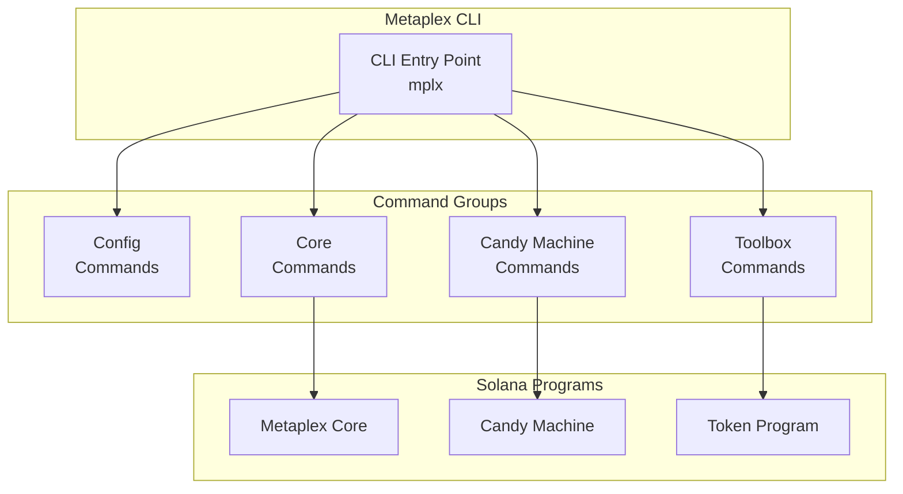

# Other — README.md

# Metaplex CLI

A powerful command-line interface for interacting with the Metaplex ecosystem on Solana. This CLI provides tools for managing digital assets, collections, tokens, candy machines, and more.

## Beta Notice

This CLI and software is in beta and public testing. Be aware that:

- Bugs may exist and functionality may change daily as updates are implemented
- Commands and their parameters are subject to change
- Documentation may be incomplete at times

## Installation

### Global NPM Installation

Install the CLI globally using npm:

```sh
npm install -g @metaplex-foundation/cli
```

After installation, invoke the CLI using the `mplx` command:

```sh
mplx --help
```

### Development Installation

For contributors or those wanting the latest unreleased changes:

```sh
git clone https://github.com/metaplex-foundation/cli.git
cd cli
npm install
npm run build
npm run mplx
```

The `npm run mplx` command invokes the CLI from the local build.

## Quick Start

### 1. Configure Your Environment

Before creating assets, configure your RPC endpoint and wallet.

#### RPC Configuration

The CLI supports multiple RPC endpoints. Add, list, and switch between them:

```sh
# Add a new RPC endpoint
mplx config rpcs add rpc1 https://my-custom-rpc.com/rpc

# List all configured RPCs
mplx config rpcs list

# Interactively select an active RPC
mplx config rpcs set
```

#### Wallet Configuration

Similarly manage multiple wallets:

```sh
# Add a new wallet (supports keypair files)
mplx config wallets add wallet1 ./path/to/keypair.json

# List all configured wallets
mplx config wallets list

# Interactively select an active wallet
mplx config wallets set
```

### 2. Create Assets

#### Create a Collection

```sh
# Create with pre-hosted metadata URI
mplx core collection create --name "My Collection" --uri "https://example.com/collection-metadata.json"

# Create with local files (CLI handles upload)
mplx core collection create --files --image ./image.png --json ./collection-metadata.json

# Generate template files for manual editing
mplx core collection template
```

#### Create an Asset

```sh
# Create with pre-hosted metadata URI
mplx core asset create --name "My Asset" --uri "https://example.com/metadata.json"

# Create with local files
mplx core asset create --files --image ./image.png --json ./metadata.json

# Generate template files
mplx core asset template
```

#### Create a Token

```sh
# Interactive token creation wizard
mplx toolbox token create --wizard

# Or specify parameters directly
mplx toolbox token create \
  --name "My Token" \
  --symbol "TOKEN" \
  --decimals 9 \
  --image ./token-logo.png \
  --mint 1000000000
```

## Candy Machine

The CLI includes a wizard for creating and managing NFT drops:

```sh
mplx cm create --wizard
```

The wizard guides you through:

- Directory and asset selection
- Collection configuration
- Guard setup (minting rules)
- Guard groups (tiered minting)
- Asset validation and upload
- Candy machine creation

### Wizard Features

- **Guided prompts**: Step-by-step interactive workflow
- **Asset validation**: Automatic discovery with actionable error messages
- **Progress tracking**: Visual indicators for uploads and transactions
- **Safety features**: File overwrite protection and abort options
- **Cache reuse**: Smart detection of previously uploaded assets
- **Completion summary**: Detailed output with next steps and transaction IDs

### Example Output

```
--------------------------------
    Welcome to the Candy Machine Creator Wizard!
    This wizard will guide you through the process of creating a new candy machine.                
--------------------------------
✔ Directory name for your Candy Machine project? candy1
✔ Directory "candy1" already exists and contains 3 files. Type 'y' to use, 'n' to abort, or 'q' to quit: y
✔ Move your assets to the assets folder and press enter to continue, or type q to abort 
📁 Asset Discovery:
✔ Found 100 JSON files
✔ Found 100 image files
✔ Found collection metadata
✔ Found collection image
✔ Should the NFTs be mutable? (y/n or q to quit) y
✔ Do you want to create global guards? (y/n or q to quit) n
✔ Do you want to create guard groups for minting? (y/n or q to quit) n
⚠️  Warning: You have not set any global guards or guard groups. This may result in a non-functional candy machine. Consider adding at least one guard or group.

Configuration saved to: /path/to/candy1/cm-config.json
📁 Using existing asset cache (100 items already uploaded)
✔ Upload validation completed
✔ Collection image uploaded
✔ Collection metadata uploaded
✔ Collection created
⠦ Creating candy machine
Tx confirmed
✔ Candy machine created - HVgv54E36CRxGZoq9TCWafTV6WA1tMX33rNXrBX3wW9
✔ Sent 13 transactions
✔ Confirmed 13 transactions

🎉 Wizard complete! Here is a summary of your setup:
- Directory: candy1
- Assets: 100 JSON, 100 images, 0 animations
- Collection: Collection
- Collection ID: 5hJkVr6ETbPdtxmv8LfcUt1eumvSuWVZPRqqNS6byNYh
🎉 Candy machine created successfully!
```

For advanced candy machine usage, see the [Candy Machine Documentation](docs/candyMachine/index.md).

## Command Structure

Commands follow a consistent pattern:

```
mplx <program> <object> <command> [flags]
```

| Component | Description |
|-----------|-------------|
| `program` | The feature group (core, cm, toolbox, config) |
| `object` | The entity to operate on (asset, collection, token, etc.) |
| `command` | The action to perform (create, update, burn, etc.) |
| `flags` | Parameters and options |

### Examples

```sh
mplx core asset create --name "Asset Name" --uri "metadata.json"
mplx core collection burn --mint-id <MINT_ADDRESS>
mplx cm upload --keypair ./wallet.json
```

### Getting Help

Use `--help` on any command for detailed usage information:

```sh
mplx --help
mplx core --help
mplx core asset create --help
```

## Command Groups

### Core Commands

Manage digital assets and collections using the Core program:

- **Asset operations**: Create, update, burn, transfer, and manage NFTs
- **Collection operations**: Create and manage asset collections
- **Plugin system**: Extend asset functionality with plugins

See [Core Commands Documentation](docs/core.md).

### Candy Machine Commands

NFT minting and drop management:

- **Creation**: Create candy machines with wizard or manual workflow
- **Upload**: Upload and index assets
- **Insertion**: Add assets to existing candy machines
- **Guards**: Configure minting rules and access controls
- **Groups**: Create tiered minting groups

See [Candy Machine Documentation](docs/candyMachine/index.md).

### Configuration Commands

Manage CLI settings:

- **RPC management**: Add, list, and switch RPC endpoints
- **Wallet management**: Add, list, and switch wallets
- **Explorer preferences**: Configure block explorer links

See [Configuration Documentation](docs/config.md).

### Toolbox Commands

Utility operations:

- **SOL operations**: Transfer and manage SOL
- **Token management**: Create and manage SPL tokens
- **Rent calculations**: Estimate rent costs for accounts

See [Toolbox Documentation](docs/toolbox.md).

## Architecture



The CLI is built on [oclif](https://oclif.io), a framework for building command-line interfaces in Node.js.

## Troubleshooting

### Common Issues

**RPC Connection Errors**
- Verify your RPC endpoint is correct: `mplx config rpcs list`
- Try switching to a different RPC: `mplx config rpcs set`

**Wallet Not Found**
- Ensure the keypair file path is correct
- Check file permissions allow reading the keypair

**Transaction Failures**
- Verify sufficient SOL balance for transactions and rent
- Check that the connected wallet has necessary permissions
- Ensure RPC is synced and not returning stale data

### Getting Help

- Check command help: `mplx [COMMAND] --help`
- Review documentation at the links above
- Report issues at https://github.com/metaplex-foundation/cli/issues