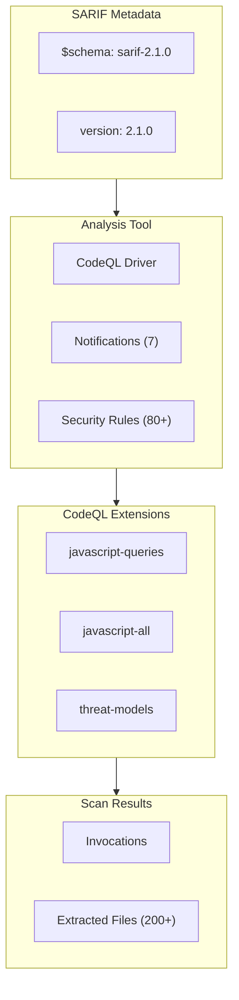

# Other — results.sarif

# CodeQL SARIF Security Analysis Results

## Overview

This module (`results.sarif`) is a **SARIF (Static Analysis Results Interchange Format)** output file generated by CodeQL, GitHub's static analysis engine. It contains the results of a security scan performed on the codebase.

SARIF is an OASIS standard format for representing static analysis results. This particular file captures findings from a JavaScript/TypeScript security analysis using CodeQL v2.25.2.

## File Structure

## Key Components

### Tool Configuration

| Property | Value |
|----------|-------|
| **Tool** | CodeQL |
| **Organization** | GitHub |
| **Version** | 2.25.2 |
| **Language** | JavaScript/TypeScript |

### Notifications

The scan includes diagnostic notifications for:

- **Extraction errors** (`js/diagnostics/extraction-errors`) — Files that failed during CodeQL extraction
- **Successfully extracted files** (`js/diagnostics/successfully-extracted-files`) — Files that were successfully analyzed
- **Expected extracted files** (`js/baseline/expected-extracted-files`) — Files expected in the source archive
- **File coverage baseline** — Telemetry for coverage tracking
- **Platform** — Execution platform information
- **Database operations** — `database/create` and `database/analyze` events

### Security Rules (80+ rules)

The analysis checks for numerous security vulnerabilities organized by category:

#### Injection Vulnerabilities

| Rule ID | Description | Severity |
|---------|-------------|----------|
| `js/command-line-injection` | Uncontrolled command line | **Error** |
| `js/shell-command-constructed-from-input` | Unsafe shell command from input | **Error** |
| `js/sql-injection` | Database query built from user-controlled sources | **Error** |
| `js/xpath-injection` | XPath injection | **Error** |
| `js/code-injection` | Code injection | **Error** |
| `js/template-object-injection` | Template Object Injection | **Error** |

#### Cross-Site Scripting (XSS)

| Rule ID | Description | Severity |
|---------|-------------|----------|
| `js/xss` | Client-side cross-site scripting | **Error** |
| `js/reflected-xss` | Reflected cross-site scripting | **Error** |
| `js/stored-xss` | Stored cross-site scripting | **Error** |
| `js/xss-through-dom` | DOM text reinterpreted as HTML | Warning |
| `js/xss-through-exception` | Exception text reinterpreted as HTML | Warning |

#### Cryptography & Data Protection

| Rule ID | Description | Severity |
|---------|-------------|----------|
| `js/disabling-certificate-validation` | Disabling certificate validation | **Error** |
| `js/weak-cryptographic-algorithm` | Broken or weak cryptographic algorithm | Warning |
| `js/insufficient-key-size` | Weak cryptographic key | Warning |
| `js/clear-text-storage-of-sensitive-data` | Clear text storage of sensitive information | **Error** |
| `js/clear-text-logging` | Clear-text logging of sensitive information | **Error** |
| `js/insecure-randomness` | Cryptographically weak RNG | Warning |

#### Prototype & Object Manipulation

| Rule ID | Description | Severity |
|---------|-------------|----------|
| `js/prototype-pollution` | Prototype-polluting merge call | **Error** |
| `js/prototype-polluting-assignment` | Prototype-polluting assignment | Warning |
| `js/prototype-pollution-utility` | Prototype-polluting function | Warning |

#### Input Validation & Sanitization

| Rule ID | Description | Severity |
|---------|-------------|----------|
| `js/incomplete-sanitization` | Incomplete string escaping | Warning |
| `js/incomplete-html-attribute-sanitization` | Incomplete HTML attribute sanitization | Warning |
| `js/incomplete-url-substring-sanitization` | Incomplete URL substring sanitization | Warning |
| `js/client-side-unvalidated-url-redirection` | Client-side URL redirect | **Error** |
| `js/server-side-unvalidated-url-redirection` | Server-side URL redirect | Warning |

#### Regular Expression Vulnerabilities

| Rule ID | Description | Severity |
|---------|-------------|----------|
| `js/redos` | Inefficient regular expression (exponential time) | **Error** |
| `js/polynomial-redos` | Polynomial regular expression | Warning |
| `js/incomplete-hostname-regexp` | Incomplete hostname regex | Warning |
| `js/overly-large-range` | Overly permissive regex range | Warning |

#### Framework-Specific Issues

| Rule ID | Description | Severity |
|---------|-------------|----------|
| `js/disabling-electron-websecurity` | Electron webSecurity disabled | **Error** |
| `js/enabling-electron-insecure-content` | Electron allowRunningInsecureContent | **Error** |
| `js/angular/double-compilation` | Angular double compilation | Warning |
| `js/angular/disabling-sce` | Angular SCE disabled | Warning |
| `js/unsafe-jquery-plugin` | Unsafe jQuery plugin | Warning |

#### Other Notable Rules

| Rule ID | Description | Severity |
|---------|-------------|----------|
| `js/request-forgery` | Server-side request forgery (SSRF) | **Error** |
| `js/zipslip` | Zip Slip directory traversal | **Error** |
| `js/path-injection` | Uncontrolled data in path expression | **Error** |
| `js/missing-csrf-validation` | Missing CSRF middleware | **Error** |
| `js/xxe` | XML external entity expansion | **Error** |
| `js/unsafe-deserialization` | Deserialization of user-controlled data | Warning |
| `js/cors-permissive-configuration` | Permissive CORS configuration | Warning |
| `js/stack-trace-exposure` | Information exposure through stack trace | Warning |

### CodeQL Extensions Used

The analysis leveraged three CodeQL packs:

1. **codeql/javascript-queries** (v2.3.7) — Security and quality queries for JavaScript
2. **codeql/javascript-all** (v2.6.27) — Comprehensive JavaScript/TypeScript library
3. **codeql/threat-models** (v1.0.47) — Threat modeling support

## Analyzed Files

The scan processed **200+ JavaScript/TypeScript files** across the following categories:

### Configuration Files
- `.eslintrc.json`, `eslint.config.js`
- `.oclifrc.cjs`, `.validator.cjs`
- `package.json`, `pnpm-lock.yaml`
- `oclif.manifest.json.js`

### CLI Entry Points
- `bin/dev.js`, `bin/run.js`
- `scripts/createTestCandyMachineDirectory.js`

### Source Commands (`src/commands/`)
- **Agents**: `fetch.ts`, `register.ts`, `set-agent-token.ts`, executive subcommands
- **BG (Block Generator)**: `collection/`, `nft/`, `tree/` subcommands
- **CM (Candy Machine)**: `create.ts`, `fetch.ts`, `insert.ts`, `upload.ts`, `validate.ts`, `withdraw.ts`, `guard/` subcommands
- **Config**: `get.ts`, `set.ts`, `explorer/`, `rpcs/`, `storage/`, `wallets/` subcommands
- **Core**: `asset/`, `collection/`, `plugins/` subcommands
- **Distro**: `create.ts`, `deposit.ts`, `fetch.ts`, `withdraw.ts`
- **Genesis**: `bucket/`, `presale/`, `launch/`, `claim.ts`, `create.ts`, `finalize.ts`, etc.
- **TM (Token Manager)**: `create.ts`, `transfer.ts`, `update.ts`
- **Toolbox**: `lut/`, `rent.ts`, `sol/`, `storage/`, `template/`, `token/`, `transaction.ts`

### Library Files (`src/lib/`)
- `Context.ts`, `FileSigner.ts`, `LedgerSigner.ts`, `StandardColors.ts`
- `cm/` utilities: candy guards schema, CM utilities, JSON guard parser, prompts, types, upload/validation helpers
- `core/` utilities: burn, create, fetch, update operations

### Root Files
- `constants.ts`, `explorers.ts`, `index.ts`

## Interpreting Results

### Severity Levels

| Level | Meaning |
|-------|---------|
| **Error** | High-confidence security vulnerability requiring immediate attention |
| **Warning** | Potential security issue or lower-confidence finding |

### Security Severity Scores

Many rules include a `security-severity` rating (0.0–10.0):

- **9.0+**: Critical — Remote code execution, complete bypass
- **7.0–8.9**: High — Significant security impact
- **5.0–6.9**: Medium — Moderate security impact
- **<5.0**: Low — Minor security concerns

### CWE References

Rules reference Common Weakness Enumeration (CWE) IDs for standardized vulnerability classification. For example:
- CWE-079: Cross-site Scripting
- CWE-089: SQL Injection
- CWE-078: OS Command Injection
- CWE-022: Path Traversal

## Usage

This SARIF file can be:

1. **Imported into GitHub Advanced Security** — Displays findings in the Security tab
2. **Uploaded to SARIF viewers** — Tools like SARIF UI or VS Code SARIF extension
3. **Integrated into CI/CD** — Parse results for build pass/fail decisions
4. **Used for security reporting** — Generate vulnerability reports

## Notes

- **No findings in this scan** — The `results` array is empty (indicated by the truncated output and no actual vulnerability entries). This means either:
  - No security issues were detected at default severity thresholds
  - The codebase passed all enabled security checks
  
- **Extraction-only mode** — The file shows successful extraction notifications for all analyzed files, indicating a complete CodeQL database was created

- **This is a data file, not executable code** — The SARIF file is output from the analysis process, not part of the application's runtime code