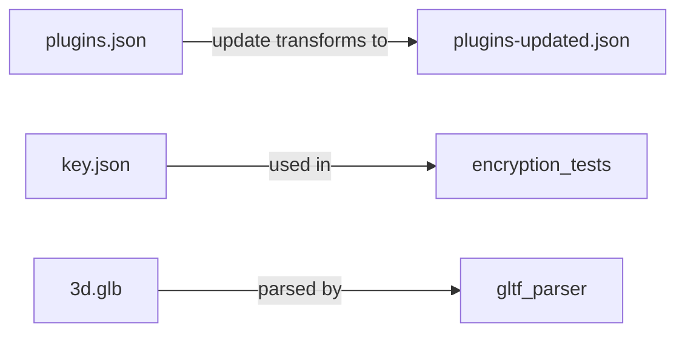

# Other — test-files

# Test Files Module

This module contains static test fixtures used throughout the codebase for testing file parsing, serialization, and data processing functionality. These files serve as controlled inputs and expected outputs for various test scenarios.

## Overview

The test-files module provides:

- **Binary test data** for validating binary format parsers
- **JSON configuration fixtures** for testing serialization/deserialization
- **Before/after pairs** for testing data transformation logic

## File Reference

### 3d.glb

A binary glTF 2.0 3D model file containing a simple cube mesh.

| Property | Value |
|----------|-------|
| Format | glTF Binary (.glb) |
| Geometry | Single cube with 36 vertices |
| Attributes | POSITION, TEXCOORD_0, NORMAL |
| Index count | 36 (unsigned short indices) |
| Generator | Aspen.3D 23.2 |

**Structure breakdown:**

- **JSON chunk**: Contains the glTF scene graph with one mesh, one node, and one scene
- **BIN chunk**: Contains vertex positions (VEC3), texture coordinates (VEC2), normals (VEC3), and indices

**Use cases:**
- Testing glTF/glb parser implementations
- Validating binary buffer reading and chunk parsing
- Testing 3D asset loading pipelines

### key.json

A JSON array containing 64 bytes of data represented as integers (0-255 range).

```json
[196, 167, 246, 133, 208, 120, 170, 18, ...]
```

**Use cases:**
- Testing encryption/decryption routines
- Validating byte array serialization
- Testing key derivation or hashing functions

### plugins.json and plugins-updated.json

A pair of JSON files representing a plugin configuration before and after an update operation.

**plugins.json (original):**
```json
[
  {
    "type": "Attributes",
    "authority": { "type": "UpdateAuthority" },
    "attributeList": [
      { "key": "Background", "value": "Blue" }
    ]
  }
]
```

**plugins-updated.json (updated):**
```json
[
  {
    "type": "Attributes",
    "authority": { "type": "UpdateAuthority" },
    "attributeList": [
      { "key": "Background", "value": "Red" },
      { "key": "Rarity", "value": "Legendary" }
    ]
  }
]
```

**Use cases:**
- Testing JSON patch/diff operations
- Validating plugin configuration merging
- Testing update/upgrade workflows

## File Relationships



## Integration Notes

These test files are loaded as static resources. No runtime generation or modification occurs. Tests that consume these files should:

1. Read files from the module's resource path
2. Use binary mode for `3d.glb` and `key.json`
3. Parse JSON files with appropriate error handling for `plugins*.json`

## Adding New Test Files

When adding new test fixtures to this module:

1. Choose a descriptive filename indicating the file's purpose
2. For JSON files, ensure valid, formatted output
3. For binary files, document the format and structure in code comments
4. Update this documentation with the new file's details