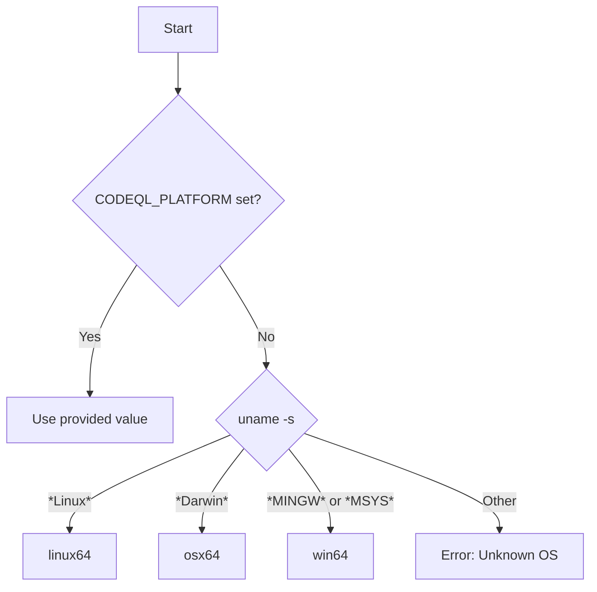
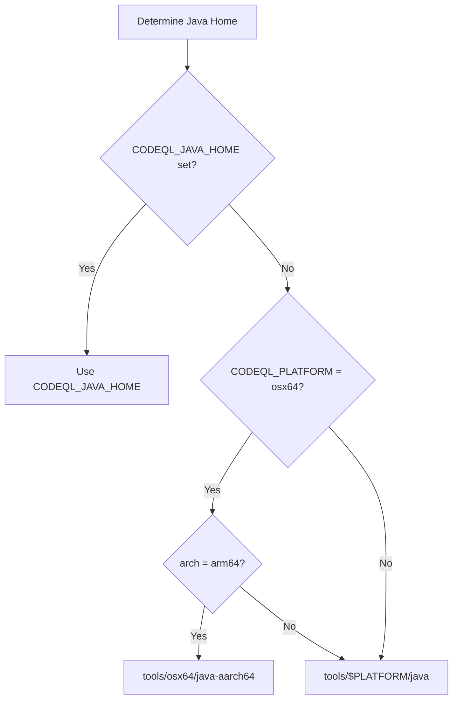

# Other — tools-codeql

# CodeQL Launcher Script

## Overview

This script (`tools/codeql`) is the entry point for running CodeQL. It acts as a bootstrapper that:

1. Detects the operating system platform
2. Locates the CodeQL distribution directory
3. Handles platform-specific setup (especially macOS security features)
4. Configures the Java runtime environment
5. Launches the actual CodeQL CLI implemented in Java

The script is designed to work whether invoked directly, through a symlink, or via a symlink farm—making it flexible for different installation methods.

---

## Environment Variables

### Input Variables (Used by the Script)

| Variable | Description |
|----------|-------------|
| `CODEQL_PLATFORM` | Override automatic platform detection. Valid values: `linux64`, `osx64`, `win64` |
| `CODEQL_DIST` | Override automatic distribution directory discovery. Should point to the root of a CodeQL distribution |
| `CODEQL_JAVA_HOME` | Override the Java runtime used to launch CodeQL |
| `CODEQL_ISATTY` | Set internally based on whether stderr is a TTY |

### Output Variables (Set by the Script)

| Variable | Description |
|----------|-------------|
| `CODEQL_DIST` | The resolved CodeQL distribution directory path |
| `CODEQL_PLATFORM` | The detected or specified platform |
| `CODEQL_ISATTY` | Set to `stderr` if stderr is a terminal, unset otherwise |

---

## Platform Detection

The script automatically detects the platform when `CODEQL_PLATFORM` is not set:



The platform determines:
- Which Java runtime directory to use (`tools/linux64/java`, `tools/osx64/java`, etc.)
- Whether macOS-specific security handling is applied

---

## Distribution Directory Discovery

The script locates the CodeQL distribution by following symlinks from `$0` (the script's own path) until it finds a directory containing `tools/codeql.jar`.

### Discovery Logic

1. **Trust override**: If `CODEQL_DIST` is already set and contains both `codeql` and `tools/codeql.jar`, use it directly (avoiding expensive symlink traversal)

2. **Symlink following**: Otherwise, starting from `$0`:
   - Read the symlink target
   - Resolve relative paths correctly (relative to the symlink's directory)
   - Repeat until `tools/codeql.jar` is found
   - Use `pwd` (with `-W` flag on Windows) to get the canonical path

3. **Error handling**: If no `codeql.jar` is found after following all symlinks, exit with an error

This design supports:
- Direct invocation: `./codeql` from the distribution directory
- User symlinks: Users creating their own symlinks in `$PATH`
- Symlink farms: Automated deployment via symlink replication

---

## macOS-Specific Handling

When running on macOS (`CODEQL_PLATFORM=osx64`), the script performs additional setup:

### Downloads Directory Restriction

CodeQL cannot run from within `~/Downloads` due to macOS security restrictions. The script checks if `CODEQL_DIST` starts with `$HOME/Downloads` and exits with a clear error message if so.

### Quarantine Attribute Removal

macOS marks files downloaded from the internet with quarantine attributes (via `xattr`). These attributes can interfere with CodeQL's operation. The script:

1. Checks if the distribution and `codeql` binary are writable
2. Uses macOS-specific tools (`/usr/bin/xattr`, `/usr/bin/find`, `/usr/bin/xargs`) rather than GNU versions
3. Removes extended attributes from:
   - All executables in `osx64/` or `macos/` subdirectories
   - The `codeql` script itself
4. Makes the `codeql` script read-only (`chmod a-w`) to prevent modification

---

## JVM Argument Processing

The script intercepts `-J` arguments and passes them to the JVM instead of the CodeQL CLI:

| Input | JVM Argument |
|-------|--------------|
| `-J` (next arg) | Next argument as-is |
| `-J=value` | `value` (without `-J=`) |
| `-Jvalue` | `value` (without `-J`) |

All other arguments (including `--`) are passed to the CodeQL CLI unchanged.

Example:
```bash
codeql -J-Xmx4g query --help
# Becomes: java -Xmx4g com.semmle.cli2.CodeQL query --help
```

---

## Java Home Selection

The script determines which Java runtime to use based on architecture:



The resolved Java home must contain `bin/java`.

---

## Chainfile Mechanism

CodeQL uses a "chainfile" mechanism for deferred operations that need to run after the JVM terminates:

1. **Creation**: A temporary file is created via `mktemp`
2. **Passing**: The path is passed to the JVM via `-Dcodeql.chainer.v2=$chainfile`
3. **Execution**: After the JVM exits with code 70 (indicating chainable work), the script sources the chainfile
4. **Continuation**: If the sourced script sets `CODEQL_CHAIN_NOW=yes`, the loop continues; otherwise, an error occurs

This allows CodeQL to schedule additional work that must occur in a fresh process context.

---

## Exit Codes

| Code | Meaning |
|------|---------|
| 3 | Launcher failure (invalid platform, cannot locate distribution) |
| 70 | Chainfile available (deferred work to perform) |
| 100 | Chainfile error (partially written) |
| Other | Exit code from the CodeQL Java process |

---

## Usage

The script is typically invoked indirectly through the `codeql` command:

```bash
# Run a query
codeql query create --language=javascript --output=my-db
codeql query run --database=my-db my-query.ql

# Get help
codeql --help

# Use JVM options
codeql -J-Xmx8g -J-XX:+UseG1GC query run --database=my-db my-query.ql
```

The script handles all the bootstrapping so users don't need to invoke Java directly or set environment variables manually.