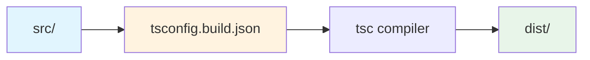

# Other — tsconfig.build.json

# tsconfig.build.json

## Overview

`tsconfig.build.json` is the TypeScript compiler configuration used for production builds. It extends the base `tsconfig.json` and applies build-specific settings that optimize the compiled output for distribution.

## Purpose

This configuration file tells the TypeScript compiler (`tsc`) how to transform source code in `src/` into compiled JavaScript in `dist/`. It's specifically designed for the build process, excluding test files and configuring output paths for production use.

## Configuration Breakdown

### Extension

```json
"extends": "./tsconfig.json"
```

Inherits all settings from the base configuration. This ensures consistency between development and build compilation while allowing build-specific overrides.

### Exclusions

```json
"exclude": ["test/**/*"]
```

Excludes all test files from the build output. Test files are not needed in production and excluding them:
- Reduces final bundle size
- Prevents accidental inclusion of test utilities
- Speeds up the build process

### Compiler Options

| Option | Value | Purpose |
|--------|-------|---------|
| `rootDir` | `"src"` | Specifies the root directory of source files |
| `outDir` | `"dist"` | Specifies where compiled output is written |
| `baseUrl` | `"."` | Sets the base URL for module resolution |
| `paths` | `{"*": ["src/*"]}` | Maps module aliases to source paths |
| `resolveJsonModule` | `true` | Allows importing `.json` files as modules |
| `isolatedModules` | `true` | Ensures each file can be compiled independently |

## Build Pipeline



## Usage

This configuration is invoked during the build process, typically via npm scripts:

```bash
# Run a production build
npm run build

# Which internally executes:
tsc -p tsconfig.build.json
```

The compiled output in `dist/` is what gets published to npm or deployed to production environments.

## Key Differences from tsconfig.json

| Setting | tsconfig.json (dev) | tsconfig.build.json (build) |
|---------|--------------------|---------------------------|
| Test files | Included | Excluded |
| Output directory | N/A (in-memory) | `dist/` |
| Module resolution | May allow loose settings | Strict (`isolatedModules`) |

## Module Path Resolution

The `paths` configuration:

```json
"paths": {
  "*": ["src/*"]
}
```

Ensures that any bare module imports resolve to the `src/` directory. This is critical for monorepo setups or projects with internal package aliases, ensuring the build uses the correct source files.