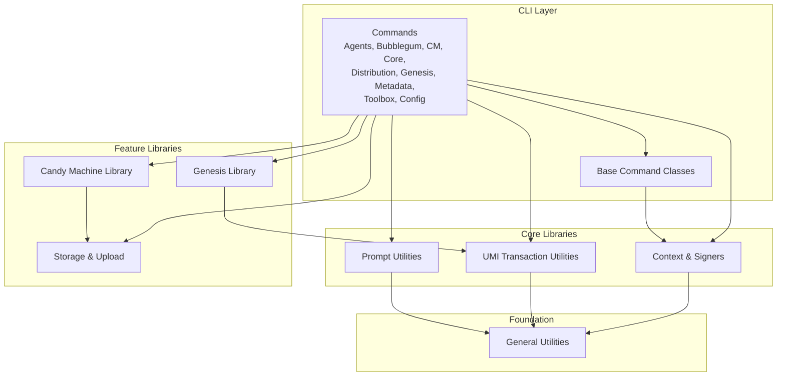

# metaplex-cli — Wiki

# Metaplex CLI

A powerful command-line interface for interacting with the Metaplex ecosystem on Solana. This CLI provides tools for managing digital assets, collections, tokens, candy machines, and more.

> **Beta Notice**: This CLI is in public beta. Commands and functionality may change daily as updates are implemented.

## What You Can Do With This CLI

- **Create and manage NFTs** — Mint standard NFTs, compressed NFTs (via Bubblegum), and Core NFTs
- **Deploy Candy Machines** — Set up automated NFT sales with customizable guard conditions
- **Manage Collections** — Create and organize asset collections on-chain
- **Handle Token Operations** — Work with SPL tokens and token accounts
- **Launch Token Projects** — Use the Genesis system for token launches with LaunchPool or Bonding Curve models
- **Distribute Assets** — Handle airdrops and asset distribution workflows
- **Upload to Decentralized Storage** — Persist images, metadata, and assets to Irys or Turbo

## Architecture Overview

The CLI is built on [OCLIF](https://oclif.io) and wraps the Metaplex UMI framework. Commands delegate to specialized libraries for blockchain interactions while using shared utilities for configuration, signing, and transaction management.



## Key Modules

### Command Infrastructure

[Base Command Classes](base-command-classes.md) provides the foundation all commands extend — handling global flags like keypair, RPC URL, and payer configuration.

[Context & Signers](context-signers.md) manages configuration loading and signer resolution, supporting keypair files, Ledger hardware wallets, and asset signers.

### Transaction Layer

[UMI Transaction Utilities](umi-transaction-utilities.md) handles the complete transaction lifecycle: building, sending, confirming, and batching. It also provides asset-signer mode support for MPL Core operations.

### Feature Libraries

- [Candy Machine Library](candy-machine-library.md) — Configuration management, asset caches, and upload workflows for candy machines
- [Genesis Library](genesis-library.md) — Token launch system supporting LaunchPool and Bonding Curve modes
- [Core NFT Library](core-nft-library.md) — Operations for MPL Core assets
- [Distribution Library](distribution-library.md) — Asset distribution and airdrop functionality

### Storage

[Storage & Upload Providers](storage-upload-providers.md) integrates with Irys and Turbo for persisting files to decentralized storage.

### User Interface

[Prompt Utilities](prompt-utilities.md) provides wizard-style workflows that guide users through complex configurations without manual JSON construction.

### Utilities

[General Utilities](general-utilities.md) contains shared helpers for file operations, JSON serialization with BigInt support, validation, and blockchain explorer URLs.

## How a Command Executes

Most commands follow a similar pattern:

1. **Parse** — OCLIF parses flags and arguments into the command handler
2. **Initialize** — [Base Command Classes](base-command-classes.md) sets up the Umi instance with configuration from [Context & Signers](context-signers.md)
3. **Prompt** — If needed, [Prompt Utilities](prompt-utilities.md) collects user input via interactive wizards
4. **Execute** — The command invokes its feature library (Candy Machine, Genesis, etc.)
5. **Transact** — [UMI Transaction Utilities](umi-transaction-utilities.md) builds, sends, and confirms transactions
6. **Upload** — Assets flow through [Storage & Upload Providers](storage-upload-providers.md) to decentralized storage

For example, inserting items into a Candy Machine flows through `insertItems` → `sendAndConfirmInBatches` → `sendAllTransactions`, with progress callbacks to storage uploaders and configurable delays between batches.

## Setup

```bash
# Install globally
npm install -g @metaplex-foundation/cli

# Or run locally
npm run mplx -- <command>
```

Common commands:

```bash
# Build the project
npm run build

# Run tests
npm test

# Lint code
npm run lint
npm run lint:fix
```

## Getting Started

If you're adding a new command, start with [Base Command Classes](base-command-classes.md) to understand the command structure, then look at existing commands in the relevant domain (Candy Machine, Bubblegum, Core NFT, etc.) for patterns to follow.

For transaction-heavy operations, [UMI Transaction Utilities](umi-transaction-utilities.md) provides reusable patterns for batching, confirmation, and asset-signer workflows.