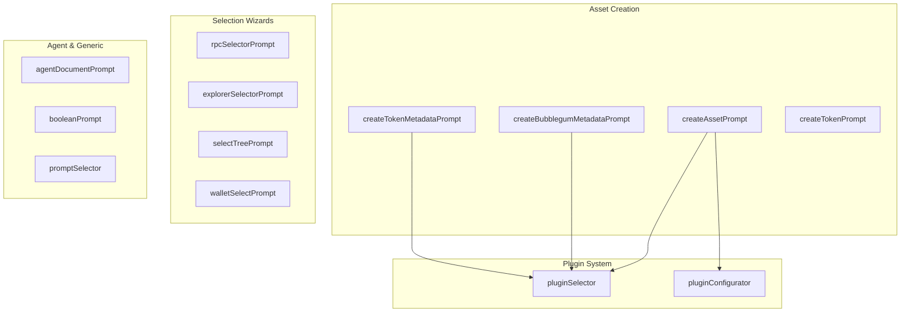

# Prompt Utilities

# Prompt Utilities Module

The Prompt Utilities module provides a collection of interactive CLI wizards for creating and configuring blockchain assets on Solana. These prompts use the `@inquirer/prompts` library to gather user input in a structured, validated way, producing data structures that feed into Metaplex Core, Bubblegum, and Token Metadata operations.

## Overview

This module serves as the user interface layer for the CLI, enabling wizard-style workflows that guide users through complex on-chain configurations without requiring them to construct JSON manually or understand low-level blockchain details.



## Core Prompt Functions

### Asset Creation Prompts

The primary prompts for creating on-chain assets share similar structures but serve different standards:

#### `createAssetPrompt(isCollection?: boolean)`

Creates metadata for Metaplex Core assets or collections. Handles image validation, file path resolution, and plugin attachment.

```typescript
interface CreateAssetPromptResult {
  name: string
  description: string
  external_url?: string
  image: string
  animation?: string
  nftType: NftType
  attributes?: Array<{ trait_type: string; value: string }>
  collection?: string
  plugins?: PluginData
}
```

Key behaviors:
- Validates image files exist and have correct extensions (PNG, JPG, GIF)
- For non-image types (video, audio, 3D models), requires both a preview image and the animation file
- Supports comma-separated input for attributes
- Validates collection IDs as Solana public keys
- Delegates plugin selection to `pluginSelector`

#### `createBubblegumMetadataPrompt(umi: Umi)`

Creates metadata for compressed NFTs (Bubblegum). Includes additional validation to verify the collection exists on-chain.

```typescript
interface CreateBubblegumMetadataPromptResult {
  // ... same as CreateAssetPromptResult
  collection?: string
  sellerFeePercentage?: number
}
```

Key behaviors:
- Validates the collection is a real Metaplex Core collection by fetching it via `fetchAsset`
- Expands `~` in file paths to the user's home directory
- Validates file paths point to regular files (not directories)
- Returns a seller fee percentage for royalties

#### `createTokenMetadataPrompt()`

Creates metadata for Token Metadata standard NFTs, including programmable NFTs (pNFTs).

```typescript
interface CreateTokenMetadataPromptResult {
  // ... same as above
  enforceRoyalties: boolean  // Determines if pnft = true
  sellerFeePercentage?: number
}
```

Key behaviors:
- The `enforceRoyalties` flag determines whether the NFT becomes a pNFT that blocks non-compliant marketplace transfers
- Defaults to enforcing royalties (safer for creators)

#### `createTokenPrompt()`

Creates fungible SPL tokens (not NFTs). Simpler than NFT prompts since tokens don't have media files.

```typescript
interface TokenWizardInput {
  name: string
  symbol: string
  decimals: number
  image?: string
  description: string
  external_url?: string
  mintAmount: number
}
```

Key behaviors:
- Validates symbol is 10 characters or less
- Decimals must be 0-9
- Mint amount must include decimals (user is prompted with an example)

### Agent Document Prompt

#### `agentDocumentPrompt()`

Creates EIP-8004 compliant agent registration documents for AI agents on Ethereum/agent networks.

```typescript
interface AgentRegistrationDocument {
  type: 'https://eips.ethereum.org/EIPS/eip-8004#registration-v1'
  name: string
  description: string
  image: string
  services?: AgentService[]
  active?: boolean
  registrations?: AgentRegistration[]
  supportedTrust?: string[]
}
```

Key behaviors:
- Supports multiple service types: Web, A2A, MCP, OASF, DID, Email, or custom
- Services can include protocol version, skills, and domains
- Trust models: Reputation, Crypto-economic, TEE Attestation
- Optional collection membership for organization

## Plugin System

The plugin system is the most complex part of the prompts module, enabling Metaplex Core's extensible plugin architecture.

### `pluginSelector(options)`

Presents a checkbox interface for selecting one or more plugins compatible with an asset or collection.

```typescript
interface PluginSelectorOptions {
  filter: PluginFilterType.Asset | PluginFilterType.Collection
  managedBy?: PluginFilterType.Authority | PluginFilterType.Owner
  type?: 'checkbox' | 'list'
  message?: string
}
```

Plugin categories:
- **Common**: Usable on both assets and collections (royalties, update, attributes, etc.)
- **Asset-only**: burn, transfer, freeze, edition
- **Collection-only**: bubblegumV2, masterEdition

Compatibility validation prevents invalid combinations. For example, `bubblegumV2` only allows: attributes, royalties, update, pFreeze, pTransfer, pBurn.

### `pluginConfigurator(plugins)`

Once plugins are selected, this prompt walks through configuration for each one:

| Plugin | Configuration Options |
|--------|----------------------|
| royalties | basis points, creators with percentages, authority |
| update | additional delegates, authority |
| burn / transfer / freeze | authority, frozen state (for freeze) |
| pBurn / pTransfer / pFreeze | authority (permanent, cannot be reversed) |
| masterEdition | max supply, name, uri, authority |
| attributes | key-value pairs to embed on-chain |
| edition | edition number |
| verifiedCreators | authority |
| autograph | authority |
| immutableMetadata | authority |
| addBlocker | authority |
| bubblegumV2 | no configuration needed |

### Plugin Compatibility

```typescript
export const validatePluginCompatibility = (selected: Plugin[]): string | null
```

This function checks selected plugins against allow-lists and returns an error message if incompatible. Used by `createAssetPrompt` to fail fast before attempting on-chain operations.

## Selection Prompts

These prompts select from existing on-chain or local resources:

### `rpcSelectorPrompt(endpoints)`

```typescript
interface RpcEndpoint {
  name: string
  url: string
}
```

### `explorerSelectorPrompt(explorers)`

```typescript
interface ExplorerEndpoint {
  displayName: string
  name: ExplorerType
  url: string
}
```

### `selectTreePrompt(network)`

Lists saved Bubblegum trees and allows selection or manual entry. Validates tree addresses have correct Solana address length (32-44 characters). Shows warnings when selecting trees from different networks than the current RPC.

### `walletSelectorPrompt(wallets)`

```typescript
interface Wallet {
  name: string
  path: string
  publicKey: string
}
```

## Generic Prompts

### `booleanPrompt(message, defaultValue)`

Simple wrapper around `@inquirer/prompts` confirm for yes/no questions.

### `promptSelector(promptItem)`

Dynamic prompt that handles multiple data types:

| Type | Behavior |
|------|----------|
| `number` | Returns a numeric value |
| `string` | Free text input |
| `boolean` | Yes/no confirmation |
| `publicKey` | Validates Solana address format |
| `date` | Parses to Unix timestamp |
| `array` | JSON array with per-item validation |

Arrays can contain nested types, with dates automatically converted to timestamps.

```typescript
interface PromptItem {
  prompt: string
  name: string
  type: PromptItemType
  required?: boolean
  items?: PromptItemType  // For array element types
  validate?: (value) => boolean | string
}
```

## Data Flow

Prompts output structured data that flows to other modules:

1. **Asset prompts** → `PluginData` objects → Metaplex Core SDK `createCollection`/`createAsset` operations
2. **Bubblegum prompt** → `createTree`/`mint` operations with compression
3. **Token prompt** → SPL token mint with metadata
4. **Plugin selectors** → Validate compatibility before passing to SDK
5. **Tree/wallet selectors** → Provide addresses for subsequent transactions

## Common Patterns

### File Validation

All prompts handling file paths:
- Check file existence with `fs.existsSync()`
- Verify extension matches expected types
- Some expand `~` to home directory
- Validate paths point to files, not directories

### Public Key Validation

Using `@metaplex-foundation/umi`:

```typescript
import { isPublicKey } from '@metaplex-foundation/umi'

// Validate user input
if (!isPublicKey(value)) return 'Invalid public key'
```

### Iterative Input

For adding multiple items (attributes, services, creators):

```typescript
let continueAdding = true
while (continueAdding) {
  // Gather input
  result.items.push(item)
  continueAdding = await confirm({ message: 'Add another?' })
}
```

## Integration Points

The prompts module depends on:
- `@inquirer/prompts` - CLI interaction primitives
- `@metaplex-foundation/umi` - Public key validation
- `@metaplex-foundation/mpl-core` - Plugin types
- `node:fs`, `node:path`, `node:os` - File system operations

The outputs feed into:
- Metaplex Core SDK (assets, collections, plugins)
- Bubblegum SDK (compressed NFTs)
- Token Metadata SDK (pNFTs, regular NFTs)
- SPL Token operations