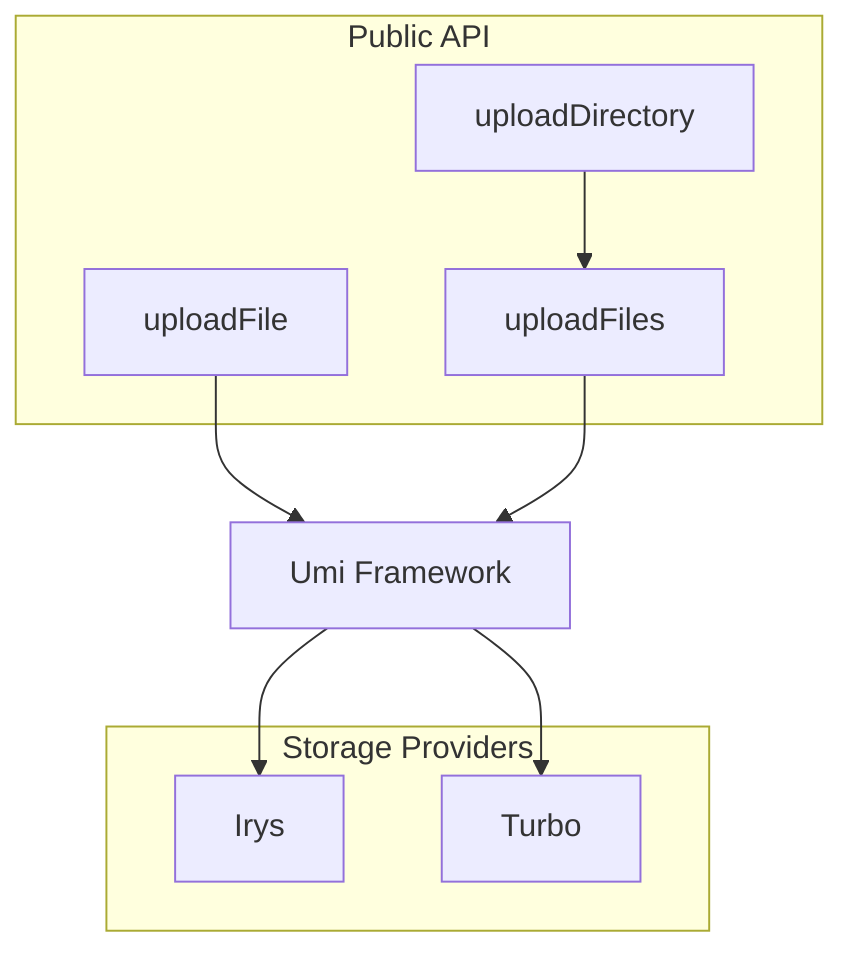

# Storage & Upload Providers

# Storage & Upload Providers

This module provides file upload functionality to decentralized storage providers for the Metaplex Umi framework. It supports uploading individual files, multiple files in batches, and entire directories.

## Overview

The uploader module integrates with storage providers like Irys and Turbo to persist files (images, metadata, assets) to decentralized storage. All uploads flow through the Umi framework's uploader interface, which abstracts the specific storage provider.



## Core Functions

### uploadFile

Uploads a single file to storage.

```typescript
uploadFile(umi: Umi, filePath: string): Promise<UploadFileRessult>
```

**Parameters:**
- `umi` - The Umi instance configured with a storage provider
- `filePath` - Path to the file (supports tilde expansion via `untildify`)

**Returns:**
```typescript
{
  uri: string      // The storage URL of the uploaded file
  mimeType: string // Detected MIME type of the file
}
```

**Behavior:**
- Expands tilde (`~`) in file paths for cross-platform compatibility
- Detects MIME type using the `mime` package
- Wraps the file in Umi's `GenericFile` format with content-type tags
- Throws on failure with descriptive error message

---

### uploadFiles

Uploads multiple files with batch processing and retry logic.

```typescript
uploadFiles(
  umi: Umi,
  filePaths: string[],
  onProgress?: (progress: number) => void
): Promise<UploadFileResult[]>
```

**Parameters:**
- `umi` - The Umi instance
- `filePaths` - Array of file paths to upload
- `onProgress` - Optional callback fired after each file completes (receives current index)

**Returns:**
```typescript
{
  index?: number      // Position in original array
  fileName: string    // Basename of the uploaded file
  uri?: string        // Storage URL (undefined on failure)
  mimeType: string    // Detected MIME type
}[]
```

**Key Features:**

| Feature | Value |
|---------|-------|
| Batch size | 50 files |
| Max retries | 3 per file |
| Backoff strategy | Exponential (`2^retry * 1000ms`) |

**Memory Optimization:**
- Only one batch (50 files) is in memory at a time
- Files are read from disk per batch, not all at once

**Retry Logic:**
- Individual files retry independently
- A failed file doesn't require re-uploading the entire batch
- Exponential backoff prevents hammering the network on transient failures

---

### uploadDirectory

Uploads all files in a directory.

```typescript
uploadDirectory(
  umi: Umi,
  directory: string,
  onProgress?: (progress: number) => void
): Promise<UploadFileResult[]>
```

**Parameters:**
- `umi` - The Umi instance
- `directory` - Path to the directory
- `onProgress` - Optional progress callback

**Validation:**
- Throws if the path doesn't exist
- Throws if the path exists but isn't a directory

**Behavior:**
- Reads all entries in the directory (non-recursive)
- Delegates to `uploadFiles` for the actual upload
- Preserves file order from `fs.readdir`

---

## Storage Providers

The provider registry in `uploadProviders/index.ts` manages storage backends.

```typescript
export const storageProviders = {
    irys,
    turbo
}
```

### Available Providers

| Provider | Name in Config | Status |
|----------|----------------|--------|
| Irys | `irys` | Active |
| Turbo | `turbo` | Active |
| Cascade | `cascade` | Commented out |

### Provider Interface

```typescript
interface StorageProvider<T = any> {
    name: 'irys' | 'cascade' | 'turbo'
    description?: string
    website?: string
    params?: {
        name: string
        description: string
        type: string
        required: boolean
    }[],
    umiPlugin: (options?: T) => Promise<UmiPlugin>
}
```

Each provider exports a `umiPlugin` function that returns a Umi plugin. Configure Umi with the chosen provider before calling upload functions:

```typescript
import { umi } from './your-umi-setup'
import { irys } from './lib/uploader/uploadProviders'

// Initialize with Irys
await umi.use(await irys.umiPlugin({ /* options */ }))
```

---

## Error Handling

All functions throw descriptive `Error` instances:

```typescript
// uploadFile
throw new Error(`File upload failed: ${error.message}`)

// uploadFiles
throw new Error(`Upload failed for ${fileName} after 3 retries: ${error.message}`)

// uploadDirectory
throw new Error(`Directory does not exist: ${path}`)
throw new Error(`Path is not a directory: ${path}`)
throw new Error(`Failed to read directory ${path}: ${error.message}`)
```

---

## Usage Example

```typescript
import { createUmi } from '@metaplex-foundation/umi'
import uploadFile from './lib/uploader/uploadFile'
import uploadDirectory from './lib/uploader/uploadDirectory'
import irys from './lib/uploader/uploadProviders/irys'

async function main() {
  // Set up Umi with Irys storage
  const umi = createUmi('https://api.mainnet-beta.solana.com')
    .use(await irys.umiPlugin({ 
      // provider options 
    }))

  // Upload single file
  const result = await uploadFile(umi, '~/nfts/image.png')
  console.log(`Uploaded to: ${result.uri}`)

  // Upload directory with progress
  const results = await uploadDirectory(
    umi, 
    './assets',
    (progress) => console.log(`Uploaded ${progress + 1} files`)
  )
  
  // Results contain URIs for all uploaded files
  const uris = results.map(r => r.uri)
}
```

---

## Integration Notes

- This module is designed to work with the Metaplex Umi framework — you must configure Umi with a storage provider before using these functions
- The module doesn't handle file filtering or validation; ensure only appropriate files are passed in
- Directory uploads are non-recursive (one level only)
- Progress callbacks are approximate — they're called after each file upload completes, not during transfer