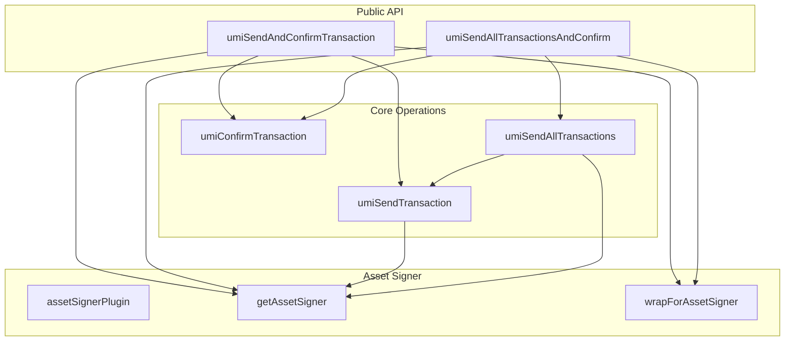

# UMI Transaction Utilities

# UMI Transaction Utilities

This module provides a complete transaction lifecycle management system for the Metaplex UMI framework. It handles building, sending, confirming, and batching transactions with special support for MPL Core asset-signer mode.

## Overview

The utilities layer transactions on top of UMI's core transaction building:

```
TransactionBuilder → sendTransaction → confirmTransaction
                                    ↓
                            sendAndConfirm (combined)
                                    ↓
                    sendAllTransactions (batching)
                                    ↓
            sendAllTransactionsAndConfirm (batch + confirm)
```

## Key Concepts

### Asset Signer Mode

When working with MPL Core assets, transactions cannot be signed by a regular wallet. Instead, the asset itself (via its PDA) must sign through the `execute` instruction. This module handles that automatically:

1. The UMI identity is set to a noopSigner (PDA) so instructions build with the PDA as authority
2. The send layer wraps transactions in `execute()` automatically
3. The real wallet signs as the execute caller and pays fees

### Confirmation Strategies

- **blockhash**: Send all transactions first, then confirm all (faster throughput)
- **transactionStatus**: Send and confirm in batches (spreads RPC load, better for rate-limited environments)

## Components

### Transaction Sending

**sendTransaction.ts** sends a single transaction and returns the signature:

```typescript
const response = await umiSendTransaction(umi, transactionBuilder, {
  commitment: 'confirmed',
  priorityFee: 1000,
  skipPreflight: false,
})
// Returns: { signature, blockhash, err }
```

Key behaviors:
- Sets the fee payer to the asset-signer's payer when in asset-signer mode
- Adds priority fees via `setComputeUnitPrice` when specified
- Signs with both the built transaction signers and `umi.identity`

### Transaction Confirmation

**confirmTransaction.ts** waits for transaction confirmation with retry logic:

```typescript
const result = await umiConfirmTransaction(umi, response, {
  commitment: 'confirmed',
})
// Returns: { confirmed: boolean, error: TransactionError | null }
```

Handles the "block height exceeded" error gracefully by querying transaction status directly.

### Combined Send + Confirm

**sendAndConfirm.ts** provides a one-liner for the full lifecycle:

```typescript
const result = await umiSendAndConfirmTransaction(umi, tx, options)
// Returns: { transaction: UmiTransactionResponse, confirmation: Result }
```

Automatically wraps transactions in `execute()` when asset-signer mode is active.

### Batch Operations

**sendAllTransactions.ts** sends multiple transactions sequentially with rate limiting:

```typescript
const results = await umiSendAllTransactions(umi, transactions, options, (index, response) => {
  console.log(`Tx ${index}: ${response.signature}`)
})
```

Defaults to 3 transactions per second to avoid RPC rate limits.

**sendAllTransactionsAndConfirm.ts** handles batch sending with two strategies:

```typescript
// Strategy 1: Send all, then confirm all (better throughput)
const results = await umiSendAllTransactionsAndConfirm(umi, txs, {
  confirmationStrategy: ConfirmationStrategy.blockhash,
})

// Strategy 2: Send and confirm in batches (better for rate limits)
const results = await umiSendAllTransactionsAndConfirm(umi, txs, {
  confirmationStrategy: ConfirmationStrategy.transactionStatus,
  batchSize: 10,
})
```

### Asset Signer Plugin

**assetSignerPlugin.ts** provides UMI plugin integration:

```typescript
// Install the plugin with asset-signer state
umi.use(assetSignerPlugin({
  info: assetSignerInfo,
  authority: assetOwner,    // Signs execute instruction
  payer: feePayer,          // Pays transaction fees (can differ)
}))

// Later, retrieve the state
const state = getAssetSigner(umi)
```

### Transaction Wrapping

**wrapForAssetSigner.ts** wraps transactions in MPL Core's `execute` instruction:

```typescript
const wrappedTx = await wrapForAssetSigner(
  umi,
  originalTx,
  assetSignerInfo,
  authority,
  payer
)
```

This:
1. Fetches the asset and optionally its collection
2. Extracts inner signers (e.g., newly created asset keypairs)
3. Builds an execute transaction with the original instructions
4. Preserves inner signers on the outer transaction

## Architecture Diagram



## Usage Examples

### Basic Transaction

```typescript
import { umiSendAndConfirmTransaction } from './lib/umi/sendAndConfirm'

const result = await umiSendAndConfirmTransaction(umi, txBuilder, {
  commitment: 'confirmed',
  priorityFee: 5000,
})
```

### Batch with Custom Batch Size

```typescript
import { umiSendAllTransactionsAndConfirm } from './lib/umi/sendAllTransactionsAndConfirm'
import { ConfirmationStrategy } from './lib/umi/sendOptions'

const results = await umiSendAllTransactionsAndConfirm(
  umi,
  transactions,
  {
    confirmationStrategy: ConfirmationStrategy.transactionStatus,
    batchSize: 5,
    commitment: 'confirmed',
  },
  'Minting NFTs'
)
```

### With Asset Signer

```typescript
import { assetSignerPlugin } from './lib/umi/assetSignerPlugin'
import { umiSendAndConfirmTransaction } from './lib/umi/sendAndConfirm'

// Install asset-signer plugin
umi.use(assetSignerPlugin({
  info: { asset: assetAddress, ... },
  authority: assetOwner,
  payer: feePayer,
}))

// Transactions automatically wrapped in execute()
const result = await umiSendAndConfirmTransaction(umi, tx)
```

## Type Reference

### UmiSendOptions

| Field | Type | Description |
|-------|------|-------------|
| priorityFee | number | Micro lamports for compute unit price |
| commitment | Commitment | Solana commitment level |
| skipPreflight | boolean | Skip preflight simulation |
| confirmationStrategy | ConfirmationStrategy | blockhash or transactionStatus |

### UmiTransactionResponse

| Field | Type | Description |
|-------|------|-------------|
| signature | string \| null | Transaction signature |
| blockhash | BlockhashWithExpiryBlockHeight \| null | Blockhash used |
| err | string \| null | Error message if failed |

### UmiSendAndConfirmResponse

| Field | Type | Description |
|-------|------|-------------|
| transaction | UmiTransactionResponse | Send result |
| confirmation | UmiTransactionConfirmationResult | Confirmation result |